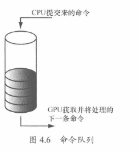
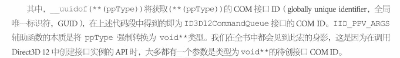
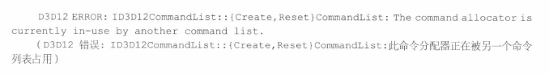
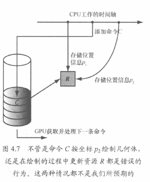
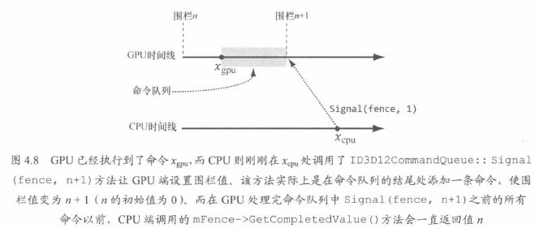

# Pre 预备知识

## 纹理格式

用于描述纹理的数据格式信息
typeless格式的纹理仅用来预留内存大小，绑定到pipeline之后，具体解释数据类型

## 交换链与页面翻转

页面翻转，就交换前后缓冲区（Front Buffer 和 Back buffer）的过程


上述结构，前台缓冲区和后天缓冲区构成的是交换链，一般是双缓冲结构
相关API： 

```C++
IDXGISwapChain //（存放的是前后两张Buffer，纹理Buffer）
IDXGISwapChain::ResizeBuffers
IDXGISwapChain::Present // 前后台互换的过程被称作 Present，呈现 显示
```

## 深度缓冲区

Depth Buffer，or Z buffer，仅对小于深度缓冲区（通过Depth Test）的像素进行绘制
深度缓冲区域也是一种纹理格式，一般有以下几种格式


用到 Depth就会用 Stencil，一般都是绑定使用的

## 资源与描述符

每次绘制 DrawCall使用的 资源需要绑定Bind 到 渲染管线上
绑定机制是通过 描述符来实现（descriptor），实现间接引用
可以认为，描述符是一种比较轻量的Struct，用于描述资源的结构，是一个中间层
GPU可以通过描述符 获取实际的资源数据 + 资源的信息，描述符的主要作用是解释资源如何被使用（绑定在那个阶段上）
也可以通过描述符获取局部数据
如果资源创建时，是typeless格式，那么创建描述符要指明具体类型

View（视图）和 descriptor（描述符）是同义词

常见描述符类型

| 简称    | 解释                                    |
| ------- | --------------------------------------- |
| CBV     | 常量缓冲区视图，constant buffer view    |
| SRV     | 着色器资源视图，Shader Resource View    |
| UAV     | 无序访问资源视图，Unordered access view |
| Sampler | 采样器资源资源，用于纹理贴图的          |
| RTV     | 渲染目标视图资源，Render Target View    |
| DSV     | 深度\模板视图资源，Depth Stencil View   |

Descriptor Heap：描述符堆。可以看做是数组，描述符的集合。本质上是存放用户程序中某种特定类型描述符的一块内存
一种类型，创建出一个或者多个描述符堆。

多个描述符--->同一个资源。多个描述符引用同一个资源的不同局部数据
一个资源可以绑定到单挑pipeline的不同阶段，每个阶段都需要设置独立的描述符
比如：纹理可以用作渲染目标和着色器资源视图。需要设置RTV和SRV
无类型格式创建一个资源，可以创建两个描述符，一个指定为浮点，一个指定为整数

## 多重多采样技术

supersampling：SSAA，超采样，4倍与屏幕大小分辨率创建后天缓冲区和深度缓冲区，到屏幕上的时候，周围4个像素一组进行解析（Resolve，降采样DownSample），获得相对平滑的像素颜色

multisampling：多重采样，MSAA，多重采样依旧是会使用4X分辨率，也就是放大进行渲染，然后选取四个像素进行解析，
不同的是会考虑多边形的内外关系和Depth Stencil的可见性，直接复制到可见性像素中，会节省资源

多重采样案例：
DXGI_SAMPLE_DESC
D3D12_MULTISAMPLE_QUALITY_LEVEL_FLAGS

## 功能分级 Feature Level

D3D_FEATURE_LEVEL对应不同D3D版本之间的各种功能

## DirectX图形基础结构

DXGI = DirectX Graphic Infrastructure，DXGI
底层任务借助一组通用API来进行处理，一般都用DXGI来命名，比如交换链，全屏，适配显示器，显示模式，支持的表面格式信息DXGI_FORMAT

IDXGIFactory，用于创建IDXGISwapChain接口和枚举适配显示器IDXGIAdapter（显卡输出，核心，集显的区别）
显示器or显示设备：Display Output；Adapter output。IDXGIOutput来表示，每个适配器与一组显示输出关联
显示设备都有支持的显示模式：DXGI_MODE_DESC; DXGI_RATIONAL;DXGI_MODE_SCANLING_ORDER;DXGI_MODE_SCALING

ID3D12Device一般指的是某一个显卡适配器，或者说显卡！

全屏模式，枚举显示模式用于设置成完全一致的，获取最佳性能

## 功能支持监测

```c++
HRESULT ID3D12Device::CheckFeatureSupport(
D3D12_FEATURE Feature,
void *pFeatureSupportData,
UINT FeatureSupportDataSize);ID3D12Device: CheckFeatureSupport
```

1. Feature：指定希望检测的功能支持类型

   | Feature类型                              | 检测功能                                                     |
   | ---------------------------------------- | ------------------------------------------------------------ |
   | D3D12_FEATURE_D3D12_OPTIONS              | 检测当前图形驱动对 Direct3D 12 各种功能的支持情况            |
   | D3D12-FEATURE_ARCHITECTURE               | 检测图形适配器中 GPU 的硬件体系架构特性。                    |
   | D3D12_FEATURE_FEATURE_LEVELS             | 检测对功能级别的支持情况。                                   |
   | D3D12_FEATURE_FORMAT_SUPPORT             | 检测对给定纹理格式的支持情况(例如，指定的格式能否用于渲染目标？或，指定的格式能否用于混合技术？）。 |
   | D3D12-FEATURE-MULTISAMPLE-QUALITY-LEVELS | 检测对多重采样功能的支持情况。                               |

2. pEeatureSupportData：指向某种数据结构的指针，该数据结构中存在检索到特定功能支持的信息，具体类型取决于Feature

   | Feature类型                              | Data实例                                      |
   | ---------------------------------------- | --------------------------------------------- |
   | D3D12_FEATURE_D3D12_OPTIONS              | D3D12_FEATURE_DATA_D3D12_OPTIONS 实例         |
   | D3D12-FEATURE_ARCHITECTURE               | D3D12_FEATURE_DATA_ARCHITECTURE               |
   | D3D12_FEATURE_FEATURE_LEVELS             | D3D12_FEATURE_DATA_FEATURE_LEVELS             |
   | D3D12_FEATURE_FORMAT_SUPPORT             | D3D12_FEATURE_DATA_FORMAT_SUPPORT             |
   | D3D12-FEATURE-MULTISAMPLE-QUALITY-LEVELS | D3D12_FEATURE_DATA_MULTISAMPLE_QUALITY_LEVELS |

3. FeatureSupportDataSize：传回上述参数中数据结构的大小


## 资源驻留

D3D12可以主动控制资源在显存中的去留（residency）
无论资源是否以以及位于显存中，都可以进行管理
程序应当避免在短时间内于显存中交换进出相同的资源，清出资源在短时间内不会再使用

```c++
//驻留资源
HRESULT ID3D12Device::MakeResident(
UINT NumObjects,
ID3D12Pageable *const *ppobjects);
//清出资源
HRESULT ID3D12Device::Evict(
UINTNumObjects,
ID3D12Pageable *const *ppobjects);
```

第一个参数表示资源数量，第二个参数表示资源数组


## 关于 Component Object Model 与 ComPtr

Component Object Model：可以理解成为接口集合，当成一个类用去使用
获取指向某个 Component 的指针 一般需要借助特定的函数接口，而不是需要去New一个出来
一般来说，Com Object 会统计下引用的次数，一般用release来减少一次引用
引用为0，自动进行回收，而非使用delete进行现实的删除

接口释放问题：
比较很传统的做法是从 IUnknown类上，使用三个接口进行，一般只用释放，方式一般用宏来进行，而非直接调用release接口

```
// d3dUtil.h
#ifndef ReleaseCom
#define ReleaseCom(x) { if(x){ x->Release(); x = 0; } }
#endif
```


智能指针 ComPtr
因为进行手动管理比较麻烦，容易出错，智能指针主要是会对Com对象的release进行自动调用
**该智能指针的大小和一般的指针大小是一致的**，没有额外的内存空间占用
智能指针需要包含头文件`wrl/client.h`，并且智能指针类模板`ComPtr`位于名称空间`Microsoft::WRL`内
COM的接口一般都用大写的'I'来开头，比如

```
ID3D12GraphicsCommandList
```

常用的方法，是123，第四第五不常用

| 方法                           | 描述                                                         |
| ------------------------------ | ------------------------------------------------------------ |
| ComPtr::Get                    | 该方法返回T*，并且不会触发引用计数加1，常用在COM组件接口的函数输入<br />常用于把原始的COM接口指针作为参数传递给函数 |
| ComPtr::GetAddressOf           | 该方法返回指向底层COM接口指针的地址，<br />该方法返回`T**`，常用在COM组件接口的函数输出<br /> |
| ComPtr::Reset                  | 该方法对里面的实例调用Release方法，并将指针置为`nullptr`，直接将Comptr的实例赋值为nullptr相同 |
| ComPtr::ReleaseAndGetAddressOf | 该方法相当于先调用`Reset`方法，再调用`GetAddressOf`方法获取`T**`，常用在COM组件接口的函数输出，适用于实例可能会被反复构造的情况下 |
| ComPtr::As                     | 一个模板函数，可以替代`IUnknown::QueryInterface`的调用，需要传递一个ComPtr实例的地址 |

| &      | 相当于调用了`ComPtr<T>::ReleaseAndGetAddressOf`方法，**不推荐使用** |
| ------ | ------------------------------------------------------------ |
| ->     | 和裸指针的行为一致                                           |
| =      | 不要将裸指针指向的实例赋给它，若传递的是ComPtr的不同实例则发生交换 |
| ==和!= | 可以和`nullptr`，或者另一个ComPtr实例进行比较                |

C++ 可读性 小技巧： 使用 模板的别名增加可读性

REFIID、COM ID：也就是指向这个对象指针的唯一接口，类似于GUID，用于确保唯一性的

# CPU与GPU的交互

Direct3D 11 支持两种绘制方式:即立即渲染( immediate rendering，利用 immediate context实现)以及延迟渲染(deferred rendering,利用deferred context实现)。
前者将缓冲区中的命令直接借驱动层发往GPU 执行，后者则与本文中介绍的命令列表模型相似(但执行命令列表时仍然要依赖immediate context)。
到了 Direct3D 12 便取消了立即渲染方式,完全采用“命令列表->命令队列”模型，使多个命令列表同时记录命令,借此充分发挥多核心处理器的性能。

## 命令队列与命令列表

GPU维护Command queue，环形缓冲区，ring buffer
CPU维护Command List，将命令提交到Command queue中
从list到queue的命令不会被立即执行，新命令会在队列之中等待执行


命令队列：ID3D12CommandQueue
描述：D3D12_COMMAND_QUEUE_DESC
创建API: ID3D12Device::CreatCommandQueue

```c++
Microsoft::WRL::ComPtr<ID3D12CommandQueue> mCommandQueue;
D3D12 COMMAND QUEUE_DESC queueDesc= {};
queueDesc.Type = D3D12_COMMAND_LIST_TYPE_DIRECT;
queueDesc.Flags = D3D12_COMMAND_QUEUE_FLAG_NONE;
ThrowIfFailed (md3dDevice->CreateCommandQueue(&queueDesc, IID_PPV_ARGS(&mCommandQueue)));
```

IID_PPV_ARGS作用：获取COM接口ID，将PPType强制转化为Void** 类型

ExecuteCommandLists是ID3D12CommandQueue的接口方法，将List内的命令添加到命令队列中

```c++
void ID3D12CommandQueue::ExecuteCommandLists(
// 第二个参数里命令列表数组中命令列表的数量
UINT Count,
// 待执行的命令列表数组，指向命令列表数组中第一个元素的指针
ID3D12CommandList *const *ppCommandLists);
```

ID3D12GraphicsCommandList 封装了一系列图形渲染命令，实际上继承于ID3D12CommandList。代码示例

```c++
// mCommandList 为一个指向 ID3D12CommandList 接口的指针
mCommandList->RSSetViewports(1,&mScreenViewport); // 添加设置ViewPort
// 清楚RTV
mCommandList->ClearRenderTargetView (mBackBufferView,Colors::LightSteelBlue, 0, nullptr);
// 发起绘制调用命令
mCommandList->DrawIndexedInstanced(36, 1, 0,0, 0);
```

List创建

```c++
HRESULT ID3D12Device::CreateCommandList(
UINT nodeMask,
D3D12_COMMAND_LIST_TYPE type,
ID3D12CommandAllocator *pCommandAllocator,
ID3D12PipelineState *pInitialState,
REFIID riid,
void **ppCommandList);
```

| 参数列表          | 含义                                                         |
| ----------------- | ------------------------------------------------------------ |
| nodeMask          | 仅有一个GPU的系统，设置为0，多CPU系统，nodemask是指List相关的物理GPU<br />ID3D12Device::GetNodeCount，GPU适配器节点数量 |
| type              | List类型                                                     |
| pCommandAllocator | List相关的Allocator，与上述的type需要保持一致                |
| pInitialState     | 指定List的渲染流水管线的初始状态。打包类型可以是nullptr      |
| riid              | 待创建ID3D12CommandList的接口COM ID                          |
| ppCommandlIST     | 输出指向所建List的指针                                       |

添加完成后，需要再调用ExecuteComm的andLists加入Queue
命令都添加完毕后，需要结束命令的记录，在加入队列前，一定要关闭记录！！！！！

```c++
// OrgAPI: ID3D12GraphicsCommandList：：Close
mCommandList->Close ();
```

ID3D12CommandAllocator：List内的命令仅仅是索引，实际存放在CommandAllocator上。queue从list中获取命令时，主要引用的是allocator里面的命令。Allocator是由ID3D12Device创建的

```c++
HRESULT ID3D12Device::CreateCommandAllocator(
D3D12_COMMAND_LIST_TYPE type,
REFIID riid,
void **ppCommandAllocator);
```

| 参数               | 含义                                                         |
| ------------------ | ------------------------------------------------------------ |
| Type               | 命令列表类型，常用两种<br />1. D3D12_COMMAND_LIST_TYPE_DIRECT：GPU直接执行的命令<br />2. D3D12_COMMAND_LIST_TYPE_BUNDLE：命令列表打包bundle。构建List会产生CPU开销<br />D3D12提供优化，将List打包，打包完成(记录完毕)，驱动对命令进行预处理，渲染期间的之间进行优化 |
| riid               | 待创建ID3D12CommandAllocator接口的COM ID                     |
| ppCommandAllocator | 输出指向所建命令分配器的指针                                 |

可以创建多个List关联于同一个Allocator，但是不能同时记录command
当一个list记录时，Allocator中其他的list都是关闭的，保证一个list的命令连续的添加到allocator中
create或者reset list会处于打开的状态，占用报错如下

ID3D12GraphicsCommandList::Reset：用于安全的复用list占用的内存来记录新的命令

```c++
HRESULT ID3D12GraphicsCommandList::Reset(
ID3D12CommandAllocator *pAllocator,
ID3D12PipelineState *pInitialState) ;
```

List恢复为创建时的初始状态，可以复用底层的内存，避免释放重新分配的问题。并且不会影响queue中的命令，因为Allocator中存在的是实际的命令

ID3D12CommandAllocator::Reset：是向GPU提交了一帧的渲染命令后，为了下一帧复用Allocator的内存进行重新设置
一般参数是Void，vector::clear，内容清零，但是仍然保存有当前的内存占用。
所以需要在确定GPU执行完Allocator上所有的命令后再进行重置

## CPU与GPU的同步

经典问题保证绘制R的P1，之后绘制R的P2。需要保证不被跳过，并且绘制R的P1时，R的数据不被修改
强制CPU等待，CPU处理所有命令，达到某个围栏点(Fence point)，刷新命令队列(Flushing the command queue)，
通过围栏来实现，ID3D12Fence。这个操作会导致CPU空闲

```c++
HRESULT ID3D12Device::CreateFence(
	UINT64 InitialValue,
	D3D12_FENCE_FLAGS Flags,
	REFIID riid,
	Void **ppFence);

ThrowIfFailed(md3Device->CreateFence(0, D3D12_FENCE_FLAG_NONE, IID_PPV_ARGS(&mFence)));
```

UINT64的值是表示围栏点的整数，初始化为0，每需要增加一个值就加一
ID3D12CommandQueue::Signal从GPU端设置围栏值
ID3D12Fence::Singal 从CPU端设置围栏值

```c++
UINT64 mCurrentFence = 0;
void D3DApp::FlushCommandQueue()
{
    //增加围栏值，接下来将命令标记到此围栏点
	mCurrentFence++;
	// 向命令队列中添加一条用来设置新围栏点的命令
	// 由于这条命令要交由 GPU 处理(即由 GPU 端来修改围栏值),所以在GPU 处理完命令队列中此 Signal ()
	// 的所有命令之前，它并不会设置新的围栏点①
	ThrowIfFailed (mCommandQueue->Signal (mFence.Get (), mCurrentFence));
    
	// 在 CPU 端等待 GPU，直到后者执行完这个围栏点之前的所有命令
	if (mFence->GetCompletedValue() < mCurrentFence)
    {
       	HANDLE eventHandle = CreateEventEx(nullptr, false, false, EVENT_ALL_ACCESS);
        //若GPU命中当前的围栏(即执行到Signal ()指令,修改了围栏值),则激发预定事件
        ThrowIfFailed(mFence->SetEventOnCompletion (mCurrentFence, eventHandle));
        // 等待 GPU 命中围栏，激发事件
        WaitForSingleObject(eventHandle, INFINITE);
        CloseHandle(eventHandle); 
    }
}
```



## 资源转换

比如RT，防止在写完之前被读取，需要进行状态转换，保证读写不会同时进行。会造成性能下降
读写同时发生会导致 资源冒险 resource hazard

Command List 设置 转换资源屏障数组(transition resource barrier). D3D12_RESOURCE_BARRIER
数组一般是为了一个API调用一批资源进行转换使用
一般构造结构体的辅助函数

```c++
struct CD3DX12_RESOURCE_BARRIER : public D3D12_RESOURCE_BARRIER
{
	// [...] 辅助方法
	static inline CD3DX12_RESOURCE_BARRIER Transition(
	_In_ ID3D12Resource* pResource,
	D3D12_RESOURCE_STATES stateBefore,
	D3D12_RESOURCE_STATES stateAfter,
	UINT subresource = D3D12_RESOURCE_BARRIER_ALL_SUBRESOURCES,
	D3D12_RESOURCE_BARRIER_FLAGS flags = D3D12_RESOURCE_BARRIER_FLAG_NONE)
{
	CD3DX12_RESOURCE_BARRIER result;
	ZeroMemory(&result, sizeof(result));
	D3D12_RESOURCE_BARRIER &barrier = result;
	result.Type = D3D12_RESOURCE_BARRIER_TYPE_TRANSITION;
	result.Flags = flags;
	barrier.Transition.pResource = pResource;
	barrier.Transition.StateBefore = stateBefore;
	barrier.Transition.StateAfter = stateAfter;
	barrier.Transition.Subresource = subresource;
	return result;
}	
	// [...]其他辅助方法
};
```

CD3DX12_RESOURCE_BARRIER结构体的变体，辅助结构变体(Variation)

## 命令与多线程

1. List并不是线程自由对象，多线程不能共享list，也不能调用统一list的方法，每个线程需要各自独立的list
2. allocator也不是线程自由对象。线程只能使用自己的allocator
3. queue是线程自由，多线程可以访问同一个queue，同时可以调用queue的方法，每个线程都可以想queue提交自己的list
4. 初始化时，必须指定并行list最大数量


# 初始化Direct3D

1. 用 D3D12CreateDevice 函数创建 ID3D12Device 接口实例。
2. 创建一个 ID3D12Fence 对象，并查询描述符的大小。(CPU与GPU同步)
3. 检测用户设备对 4X MSAA 质量级别的支持情况。
4. 依次创建命令队列、命令列表分配器和主命令列表。list，allocator，queue
5. 描述并创建交换链。IDXGISwapChain
6. 创建应用程序所需的描述符堆。
7. 调整后台缓冲区的大小，并为它创建渲染目标视图。
8. 创建深度/模板缓冲区及与之关联的深度/模板视图。
9. 设置视口（viewport）和裁剪矩形（scissor rectangle）。

## 1. 创建设备 Device

万物起源device，理解成一个显示适配器（抽象的理解为显卡，或者渲染模拟的显卡）
有了Device才能创建其他的D3D接口对象

```C++
HRESULT WINAPI D3D12CreateDevice(
	IUnknown* pAdapter,
	D3D_FEATURE_LEVEL MinimumFeatureLevel,
	REFIID riid, // ID3D12Device的COM ID
	void** ppDevice);
```

1. pAdapter:显示适配器，空指针则使用主显示适配器
2. 最低功能等级，显卡支持的最低的功能等级
3. riid：ID3D12Device的 COM ID
4. ppDevice：返回D3D12设备

```c++
#if defined(DEBUG) || defined (_DEBUG)
// 启用 D3D12调试层,发生错误是会向VC++输出窗口发送调试信息
{
    ComPtr<ID3D12Debug> debugController;
	ThrowIfFailed (D3D12GetDebugInterface (IID_PPV_ARGS (&debugController) )) ;
	debugController->EnableDebugLayer () ;
}
#endif

ThrowIfFailed (CreateDXGIFactory1 (IID_PPV_ARGS (&mdxgiFactory) ) ) ;
// 尝试创建硬件设备

HRESULT hardwareResult = D3D12CreateDevice(nullptr // 默认适配器
, D3D_FEATURE_LEVEL_11_0, IID_PPV_ARGS (&md3dDevice) );

// 回退至 WARP 设备
if (FAILED (hardwareResult))
{
    ComPtr<IDXGIAdapter> pWarpAdapter;
    ThrowIfFailed (mdxgiFactory->EnumWarpAdapter (IID_PPV_ARGS (&pWarpAdapter) ) ) ;
    
	ThrowIfFailed (D3D12CreateDevice (
	pWarpAdapter.Get(),
	D3D_FEATURE_LEVEL_11_0,
	IID_PPV_ARGS (&md3dDevice) ));
}
```

## 2. 创建围栏并获取描述符的大小

描述符在不同的GPU平台的大小不同，需要查询相关信息。然后把描述符的大小缓存起来

```c++
ThrowIfFailed (md3dDevice->CreateFence (0, D3D12_FENCE_FLAG_NONE, IID_PPV_ARGS(&mFence)));
mRtvDescriptorSize = md3dDevice->GetDescriptorHandleIncrementSize(D3D12_DESCRIPTOR_HEAP_TYPE_RTV);
mDsvDescriptorSize - md3dDevice->GetDescriptorHandleIncrementSize(D3D12_DESCRIPTOR_HEAP_TYPE_DSV);
mCbvUavDescriptorSize md3dDevice->GetDescriptorHandleIncrementSize(D3D12_DESCRIPTOR_HEAP_TYPE_CBV_SRV_UAV);
```

## 3. 检测对4X MSAA质量级别得支持

```c++
D3D12_FEATURE_DATA_MULTISAMPLE_QUALITY_LEVELS msQualityLevels;
msQualityLevels.Format = mBackBufferFormat;
msQualityLevels.SampleCount = 4;
msQualityLevels.Flags = D3D12_MULTISAMPLE_QUALITY_LEVELS_FLAG_NONE;
msQualityLevels.NumQualityLevels = 0;
ThrowIfFailed (md3dDevice->CheckFeatureSupport (
	D3D12_FEATURE_MULTISAMPLE_QUALITY_LEVELS,
	&msQualityLevels,
	sizeof (msQualityLevels)));
m4xMsaaQuality = msQualityLevels.NumQualityLevels;
assert(m4xMsaaQuality > 0 && "Unexpected MSAA quality level.");
```

支持的话总是会大于0

## 4. 创建queue 和 list

```c++
ComPtr<ID3D12CommandQueue> mCommandQueue;
ComPtr<ID3D12CommandAllocator> mDirectCmdListAlloc;
ComPtr<ID3D12GraphicsCommandList> mCommandList;
void D3DApp::CreateCommandobjects(){
    D3D12_COMMAND_QUEUE_DESC queueDesc = {};
	queueDesc.Type = D3D12_COMMAND_LIST_TYPE_DIRECT;
	queueDesc.Flags = D3D12_COMMAND_QUEUE_FLAG_NONE;
    // 先创建命名队列
	ThrowIfFailed (md3dDevice->CreateCommandQueue (&queueDesc, IID_PPV_ARGS (&mCommandQueue)));
	// 创建 allocator
	ThrowIfFailed (md3dDevice->CreateCommandAllocator(
        D3D12_COMMAND_LIST_TYPE_DIRECT,
        IID_PPV_ARGS (mDirectCmdListAlloc.GetAddressOf ())));
    // 创建list 绑定 allocator
    ThrowIfFailed (md3dDevice->CreateCommandList(
		0,
		D3D12_COMMAND_LIST_TYPE_DIRECT,
		mDirectCmdListAlloc.Get(), //关联命令分配器
		nullptr,// 初始化流水线状态对象 pipeline state object
		IID_PPV_ARGS (mCommandList.GetAddressOf ())));
		//首先要将命令列表置于关闭状态。这是因为在第一次引用命令列表时,我们要对它进行重置,而在调用
		//重置方法之前又需先将其关闭
	mCommandList->Close () ;
}

```

不发起绘制指定，不指定pipeline state

## 5. 描述并创建交换链

首先需要创建描述

```c++
typedef struct DXGI_SWAP_CHAIN_DESC
{
    DXGI_MODE_DESC BufferDesc;
    DXGI_SAMPLE_DESC SampleDesc;
    DXGI_USAGE BufferUsage;
    UINT BufferCount;
    HWND OutputWindow;
    BOOL Windowed;
    DXGI_SWAP_EFFECT SwapEffect;
    UINT Flags;
}DXGI_SWAP_CHAIN_DESC;

typedef struct DXGI_MODE_DESC{
    UINT Width;		// 缓冲区分辨率的宽度
    UINT Height;	// 缓冲区分辨率的高度
    DXGI_RATIONAL RefreshRate;
    DXGI_FORMAT Format;		// 缓冲区的显示格式
    DXGI_MODE_SCANLINE_ORDER ScanlineOrdering;	// 逐行扫描 vs. 隔行扫描
    DXGI_MODE_SCALING Scaling;	 // 图像如何相对于屏幕进行拉伸  
}DXGI_MODE_DESC;
```

| 结构体成员   | 描述                                                         |
| ------------ | ------------------------------------------------------------ |
| BufferDesc   | 后台缓冲区属性，仅关注长宽高、像素格式等属性                 |
| SampleDesc   | 多重采样的质量级别以及对每个像素的采样次数                   |
| BufferUsage  | 数据渲染至后台缓冲区(即用它作为渲染目标),因此将此参数指定为 DXGI_USAGE_RENDER_TARGET_OUTPUT |
| BufferCount  | 交换链中所用的缓冲区数量。我们将它指定为2，即采用双缓冲      |
| OutputWindow | 渲染窗口的句柄                                               |
| Windowed     | 若指定为true,程序将在窗口模式下运行；如果指定为 false,则采用全屏模式 |
| SwapEffect   | 指定为 DXGI_SWAP_EFFECT_FLIP_DISCARD                         |
| Flags        | 可选标志。如果将其指定为 DXGI_SWAP_CHAIN_FLAG_ALLOW_MODE_SWITCH,那么,当程序切换为全屏模式时,它将选择最适于当前应用程序窗口尺寸的显示模式。如果没有指定该标志，当程序切换为全屏模式时，将采用当前桌面的显示模式。 |

使用IDXGIFactory::CreateSwapChain 方法创建。创建新的交换链之前，需要摧毁旧的交换链，可以通过不同设置重新创建交换链，并且修改MSAA配置

```c++
DXGI_FORMAT mBackBufferFormat = DXGI_FORMAT_R8GBBBA8_UNORM;

void D3DApp::CreateSwapChain(){
    //释放之前所创的交换链,随后再进行重建
	mSwapChain.Reset () ;
    
   
	DXGI_SWAP_CHAIN_DESC sd;
	sd.BufferDesc.Width = mClientWidth;
	sd.BufferDesc.Height = mClientHeight;
    sd.BufferDesc.RefreshRate.Numerator = 60;
    sd.BufferDesc.RefreshRate.Denominator = 1;
    sd.BufferDesc.Format = mBackBufferFormat;
	sd.BufferDesc.ScanlineOrdering = DXGI_MODE_SCANLINE_ORDER_UNSPECIFIED;
    sd.BufferDesc.Scaling = DXGI_MODE_SCALING_UNSPECIFIED;
    sd.SampleDesc.Count = m4xMsaaState?4:1;
    sd.SampleDesc.Quality = m4xMsaaState?(m4xMsaaQuality - 1):0;
    sd.BufferUsage = DXGI_USAGE_RENDER_TARGET_OUTPUT;
    sd.BufferCount = SwapChainBufferCount;
    sd.OutputWindow = mhMainWnd;
    sd.Windowed = true;
    sd.SwapEffect = DXGI_SWAP_EFFECT_ FLIP_DISCARD;
    sd.Flags = DXGI_SWAP_CHAIN_FLAG_ALLOW_MODE_SWITCH;
	//注意,交换链需要通过命令队列对其进行刷新
    ThrowIfFailed (mdxgiFactory->CreateSwapChain (mCommandQueue.Get (),&sd,
    mSwapChain.GetAddressOf()));
}
```

## 6. 创建描述符堆

ID3D12DescriptorHeap: 表示描述符堆
ID3D12Device::CreateDescriptorHeap ：创建描述符堆

```c++
static const int SwapChainBufferCount = 2;// 框架中设定交换用RT为2
int mCurrentBackBuffer = 0; // 指定框架中的后台缓冲区索引

ComPtr<ID3D12DescriptorHeap> mRtvHeap;
ComPtr<ID3D12DescriptorHeap> mDsvHeap;

void D3DApp::CreateRtvAndDsvDescriptorHeaps(){
    D3D12_DESCRIPTOR_HEAP_DESC rtvHeapDesc;
	rtvHeapDesc.NumDescriptors = SwapChainBufferCount;
	rtvHeapDesc.Type = D3D12_DESCRIPTOR_HEAP_TYPE_RTV;
	rtvHeapDesc.Flags = D3D12_DESCRIPTOR_HEAP_FLAG_NONE;
		rtvHeapDesc.NodeMask = 0:
    ThrowIfFailed (md3dDevice->CreateDescriptorHeap (
    artvHeapDesc, IID_PPV_ARGS(mRtvHeap.GetAddressOf())));
    
    D3D12_DESCRIPTOR_HEAP_DESC dsvHeapDesc;
    dsvHeapDesc.NumDescriptors = 1;
    dsvHeapDesc.Type = D3D12_DESCRIPTOR_HEAP_TYPE_DSV;
    dsvHeapDesc.Flags = D3D12_DESCRIPTOR_HEAP_FLAG_NONE;
    	dsvHeapDesc.NodeMask = 0;
    ThrowIfFailed (md3dDevice->CreateDescriptorHeap (
    &dsvHeapDesc, IID PPV ARGS(mDsvHeap.GetAddressOf())));
}

// 句柄来引用描述符，需要包装获取
D3D12_CPU_DESCRIPTOR_HANDLE D3DApp::CurrentBackBufferView ()const
{
	//CD3DX12构造函数根据给定的偏移量找到当前后台缓冲区的 RTV
	return CD3DX12_CPU_DESCRIPTOR_HANDLE(
	mRtvHeap->GetCPUDescriptorHandleForHeapStart(),// 堆中的首个句柄
	mCurrBackBuffer,//偏移至后台缓冲区描述符句柄的索引
	mRtvDescriptorSize);// 描述符所占字节的大小
    
D3D12_CPU_DESCRIPTOR_HANDLE D3DApp::DepthStencilView()const
{
    return mDsvHeap->GetCPUDescriptorHandleForHeapStart();
}
```

## 7. 创建渲染目标视图

