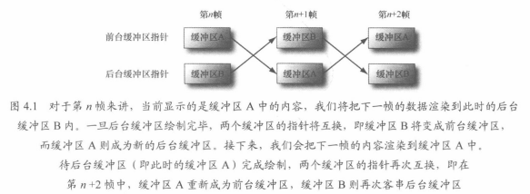
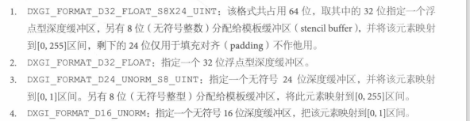
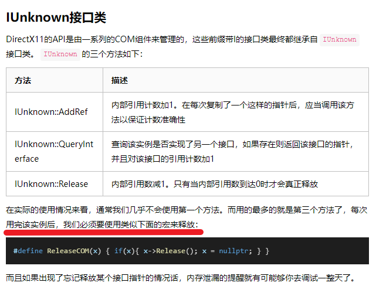
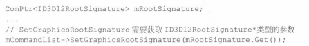
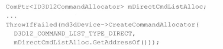
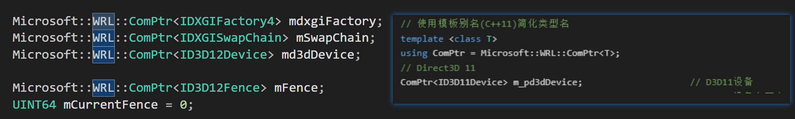

## 交换链与页面翻转

页面翻转，就交换前后缓冲区（Front Buffer 和 Back buffer）的过程


上述结构，前台缓冲区和后天缓冲区构成的是交换链，一般是双缓冲结构
相关API： 

```C++
IDXGISwapChain //（存放的是前后两张Buffer，纹理Buffer）
IDXGISwapChain::ResizeBuffers
IDXGISwapChain::Present // 前后台互换的过程被称作 Present，呈现 显示
```

## 深度缓冲区

Depth Buffer，or Z buffer，仅对小于深度缓冲区（通过Depth Test）的像素进行绘制
深度缓冲区域也是一种纹理格式，一般有以下几种格式


用到 Depth就会用 Stencil，一般都是绑定使用的

## 资源与描述符

每次绘制 DrawCall使用的 资源需要绑定Bind 到 渲染管线上
绑定机制是通过 描述符来实现（descriptor），实现间接引用
可以认为，描述符是一种比较轻量的Struct，用于描述资源的结构，是一个中间层
GPU可以通过描述符 获取实际的资源数据 + 资源的信息，描述符的主要作用是解释资源如何被使用（绑定在那个阶段上）
也可以通过描述符获取局部数据
如果资源创建时，是typeless格式，那么创建描述符要指明具体类型

View（视图）和 descriptor（描述符）是同义词

常见描述符类型

| 简称    | 解释                                    |
| ------- | --------------------------------------- |
| CBV     | 常量缓冲区视图，constant buffer view    |
| SRV     | 着色器资源视图，Shader Resource View    |
| UAV     | 无序访问资源视图，Unordered access view |
| Sampler | 采样器资源资源，用于纹理贴图的          |
| RTV     | 渲染目标视图资源，Render Target View    |
| DSV     | 深度\模板视图资源，Depth Stencil View   |

## 关于 Component Object Model 与 ComPtr

Component Object Model：可以理解成为接口集合，当成一个类用去使用
获取指向某个 Component 的指针 一般需要借助特定的函数接口，而不是需要去New一个出来
一般来说，Com Object 会统计下引用的次数，一般用release来减少一次引用
引用为0，自动进行回收，而非使用delete进行现实的删除

接口释放问题：
比较很传统的做法是从 IUnknown类上，使用三个接口进行，一般只用释放，方式一般用宏来进行，而非直接调用release接口

```
// d3dUtil.h
#ifndef ReleaseCom
#define ReleaseCom(x) { if(x){ x->Release(); x = 0; } }
#endif
```



智能指针 ComPtr
因为进行手动管理比较麻烦，容易出错，智能指针主要是会对Com对象的release进行自动调用
**该智能指针的大小和一般的指针大小是一致的**，没有额外的内存空间占用
智能指针需要包含头文件`wrl/client.h`，并且智能指针类模板`ComPtr`位于名称空间`Microsoft::WRL`内
COM的接口一般都用大写的'I'来开头，比如

```
ID3D12GraphicsCommandList
```

常用的方法，是123，第四第五不常用

| 方法                           | 描述                                                         |
| ------------------------------ | ------------------------------------------------------------ |
| ComPtr::Get                    | 该方法返回T*，并且不会触发引用计数加1，常用在COM组件接口的函数输入<br />常用于把原始的COM接口指针作为参数传递给函数 |
| ComPtr::GetAddressOf           | 该方法返回指向底层COM接口指针的地址，<br />该方法返回`T**`，常用在COM组件接口的函数输出<br /> |
| ComPtr::Reset                  | 该方法对里面的实例调用Release方法，并将指针置为`nullptr`，直接将Comptr的实例赋值为nullptr相同 |
| ComPtr::ReleaseAndGetAddressOf | 该方法相当于先调用`Reset`方法，再调用`GetAddressOf`方法获取`T**`，常用在COM组件接口的函数输出，适用于实例可能会被反复构造的情况下 |
| ComPtr::As                     | 一个模板函数，可以替代`IUnknown::QueryInterface`的调用，需要传递一个ComPtr实例的地址 |

| &      | 相当于调用了`ComPtr<T>::ReleaseAndGetAddressOf`方法，**不推荐使用** |
| ------ | ------------------------------------------------------------ |
| ->     | 和裸指针的行为一致                                           |
| =      | 不要将裸指针指向的实例赋给它，若传递的是ComPtr的不同实例则发生交换 |
| ==和!= | 可以和`nullptr`，或者另一个ComPtr实例进行比较                |

C++ 可读性 小技巧： 使用 模板的别名增加可读性