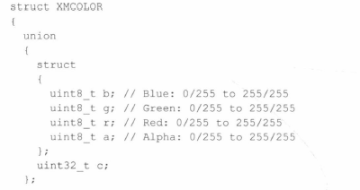
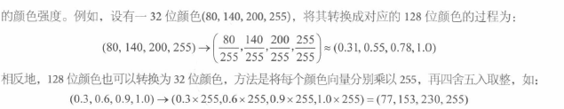
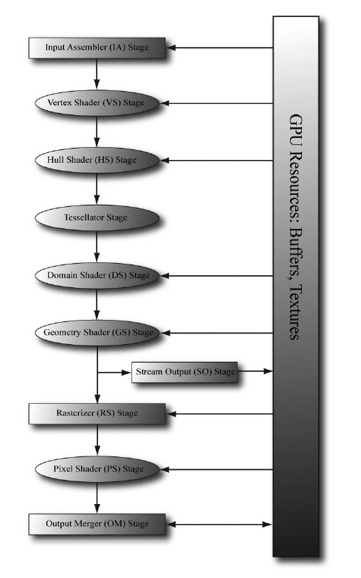

# 颜色

128位颜色（rgba每个32位），值是0-1
32位颜色（rgba每个颜色8位，0-255），值是0-255



一般来说，128位颜色用于pixel shader中进行计算，32位颜色用于显示输出


# 渲染流水管线

以摄像机为观察视角而生成的2D图像的一系列完整步骤


## 1. input assembler 输入装配器阶段

从显存中读取几何数据，，装配为 geometric primitive
顶点的数据格式自定义

图元拓扑：
需要使用顶点缓冲区Vertex buffer，绑定到渲染流水管线。是一块连续的聂村
图元拓扑primitive topology是一种设定，用于告诉D3D如何使用顶点数据来表示 几何图元

```c++
void
ID3D12GraphicsCommandList::IASetPrimitiveTopology( D3D_PRIMITIVE_TOPOLOGY Topology);
typedef enum D3D_PRIMITIVE_TOPOLOGY
{
    D3D_PRIMITIVE_TOPOLOGY_UNDEFINED = 0,
    D3D_PRIMITIVE_TOPOLOGY_POINTLIST = 1, // 每个顶点都会支撑一个单独的点
    D3D_PRIMITIVE_TOPOLOGY_LINELIST = 2, // 线，顶点会连线，n个顶点。n+1条
    D3D_PRIMITIVE_TOPOLOGY_LINESTRIP = 3, 
    D3D_PRIMITIVE_TOPOLOGY_TRIANGLELIST = 4,
    D3D_PRIMITIVE_TOPOLOGY_TRIANGLESTRIP = 5,
    D3D_PRIMITIVE_TOPOLOGY_LINELIST_ADJ = 10,
    D3D_PRIMITIVE_TOPOLOGY_LINESTRIP_ADJ = 11,
    D3D_PRIMITIVE_TOPOLOGY_TRIANGLELIST_ADJ = 12,
    D3D_PRIMITIVE_TOPOLOGY_TRIANGLESTRIP_ADJ = 13,
    D3D_PRIMITIVE_TOPOLOGY_1_CONTROL_POINT_PATCHLIST = 33,
    D3D_PRIMITIVE_TOPOLOGY_2_CONTROL_POINT_PATCHLIST = 34,
    D3D_PRIMITIVE_TOPOLOGY_32_CONTROL_POINT_PATCHLIST = 64,
} D3D_PRIMITIVE_TOPOLOGY;
```

依旧是需要使用Command List进行修改配置

```C++
mCommandList->IASetPrimitiveTopology(D3D_PRIMITIVE_TOPOLOGY_LINELIST);
/* …draw objects using line list… */
mCommandList->IASetPrimitiveTopology(D3D_PRIMITIVE_TOPOLOGY_TRIANGLELIST);
/* …draw objects using triangle list… */
mCommandList->IASetPrimitiveTopology(D3D_PRIMITIVE_TOPOLOGY_TRIANGLESTRIP);
/* …draw objects using triangle strip… */
```

