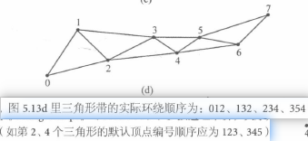
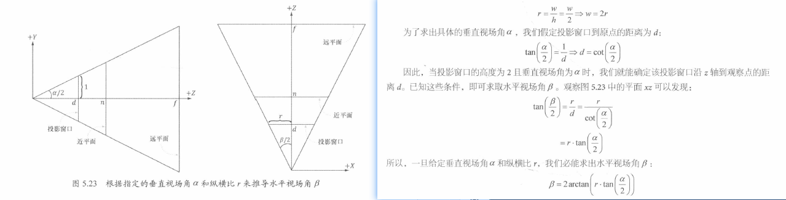
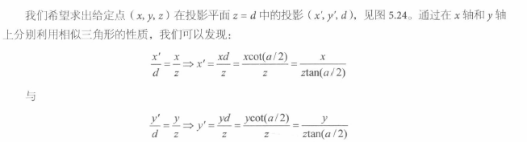
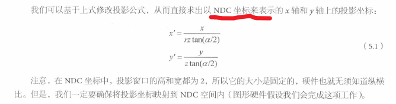
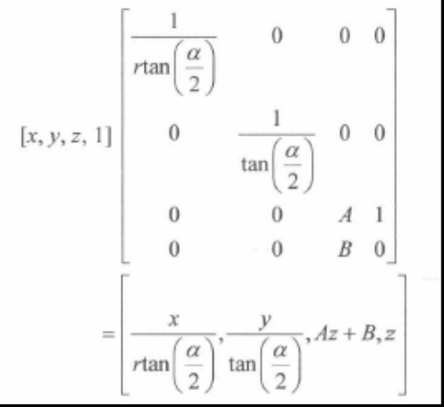
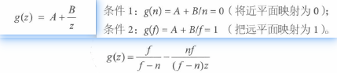
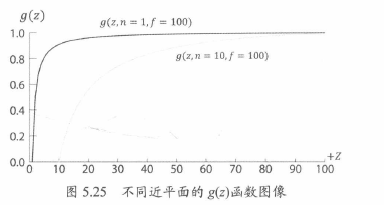
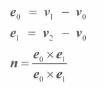

# 颜色

128位颜色（rgba每个32位），值是0-1
32位颜色（rgba每个颜色8位，0-255），值是0-255


一般来说，128位颜色用于pixel shader中进行计算，32位颜色用于显示输出

# 渲染流水管线

以摄像机为观察视角而生成的2D图像的一系列完整步骤


## 1. input assembler 输入装配器阶段

从显存中读取几何数据，，装配为 geometric primitive
顶点的数据格式自定义

图元拓扑：
需要使用顶点缓冲区Vertex buffer，绑定到渲染流水管线。是一块连续的聂村
图元拓扑primitive topology是一种设定，用于告诉D3D如何使用顶点数据来表示 几何图元

```c++
void
ID3D12GraphicsCommandList::IASetPrimitiveTopology( D3D_PRIMITIVE_TOPOLOGY Topology);
typedef enum D3D_PRIMITIVE_TOPOLOGY
{
    D3D_PRIMITIVE_TOPOLOGY_UNDEFINED = 0,
    D3D_PRIMITIVE_TOPOLOGY_POINTLIST = 1, // 每个顶点都会支撑一个单独的点
    D3D_PRIMITIVE_TOPOLOGY_LINELIST = 2, // 需要一对顶点，2n个顶点，生成N条线段
    D3D_PRIMITIVE_TOPOLOGY_LINESTRIP = 3,   // 线，顶点会连线，n个顶点。n+1条
    D3D_PRIMITIVE_TOPOLOGY_TRIANGLELIST = 4, // 三角形列表
    D3D_PRIMITIVE_TOPOLOGY_TRIANGLESTRIP = 5, //三角形带，n个顶点生成 n-2个
    D3D_PRIMITIVE_TOPOLOGY_LINELIST_ADJ = 10,
    D3D_PRIMITIVE_TOPOLOGY_LINESTRIP_ADJ = 11,
    D3D_PRIMITIVE_TOPOLOGY_TRIANGLELIST_ADJ = 12,
    D3D_PRIMITIVE_TOPOLOGY_TRIANGLESTRIP_ADJ = 13,
    D3D_PRIMITIVE_TOPOLOGY_1_CONTROL_POINT_PATCHLIST = 33,
    D3D_PRIMITIVE_TOPOLOGY_2_CONTROL_POINT_PATCHLIST = 34,
    D3D_PRIMITIVE_TOPOLOGY_32_CONTROL_POINT_PATCHLIST = 64,
} D3D_PRIMITIVE_TOPOLOGY;
```

依旧是需要使用Command List进行修改配置

```C++
mCommandList->IASetPrimitiveTopology(D3D_PRIMITIVE_TOPOLOGY_LINELIST);
/* …draw objects using line list… */
mCommandList->IASetPrimitiveTopology(D3D_PRIMITIVE_TOPOLOGY_TRIANGLELIST);
/* …draw objects using triangle list… */
mCommandList->IASetPrimitiveTopology(D3D_PRIMITIVE_TOPOLOGY_TRIANGLESTRIP);
/* …draw objects using triangle strip… */
```

Triangle Strip：
次序为偶数的三角形与次序为奇数三角形的绕序（winding order）环绕顺序是不同的。图元的顶点顺序为逆时针，顺时针方向，
GPU内部会对偶数三角形的前两个顶点顺序调换，保持与奇数绕序保持一致


Triangle List：
三角形列表，讲每三个顶点独立配成三角形，3n个顶点生成n个三角形，
区别是，Strip中的三角形是相连的

具有邻接数据（adjacent）图源拓扑：
相当于顶点额外包含数据，作为VS的输入，但是不会被会指出来

控制点面片列表：
N个Control point 的 patch list，一般用于 tessellation stage

索引：
主要去除掉复制顶点数据的一些问题
带状结构可以解决一部分重复问题，但是前提是网格可以被解释为带状结构

index 创建顶点列表（存放所有独立顶点）+ 索引列表（存储顶点列表索引值）。索引定义了顶点列表中的顶点是如何组合在一起的
索引是简单整数，不会像整个顶点结构体占用很多内存
合适的顶点缓存排序，不必要再次重复使用顶点，直接从cache中获得，刚处理的顶点历史存放在Cache中


## 2. Vertex Shader 顶点着色器阶段

顶点着色器 输入输出都为单个顶点，

将物体坐标由局部坐标转换到空间坐标时，过程称作为实例化 instancing

相机的局部坐标系被称为观察空间，给定观察点，世界空间左边向上的方向，摄像机位置，构建出view矩阵

```c++
XMMATRIX XM_CALLCONV XMMatrixLookAtLH( // Outputs viewmatrix V
FXMVECTOR EyePosition, // Input camera position Q
FXMVECTOR FocusPosition, // Input target point T
FXMVECTOR UpDirection); // Input world up direction j

XMVECTOR pos = XMVectorSet(5, 3, -10, 1.0f);
XMVECTOR target = XMVectorZero();
XMVECTOR up = XMVectorSet(0.0f, 1.0f, 0.0f, 0.0f);
XMMATRIX V = XMMatrixLookAtLH(pos, target, up);
```

投影和齐次剪裁空间：

定义平截头体：以原点作为投影的中心，并沿Z轴正方向进行观察的平截头体
近平面：near plane， n
远平面：far plane，f
垂直视场角：vertical field of view angle，α
纵横比：aspect ratio，宽高比，r。投影窗口的纵横比一般与后台缓冲区一致

根据α可以推导出，水平视场角 Horizontal field of view angle β


投影坐标


归一化投影坐标：去除缩放导致的纵横比变化，x轴的坐标从-r,r 归一到-1,1
也就是NDC空间的坐标都是不Care纵横比的，是个宽高为2的固定矩形




归一化深度值：坐标从 nf 归一化到 0-1，

非线性深度，深度缓冲区的精度问题，所以近平面和远平面需要尽可能的接近


顶点乘以投影矩阵（perspective projection matrix）后处在齐次剪裁空间（homogeneous clip space）或投影空间（project space）

```c++
XMMATRIX XM_CALLCONV XMMatrixPerspectiveFovLH(
    float FovAngleY, // vertical field of view angle in radians
    float Aspect, // aspect ratio = width / height
    float NearZ, // distance to near plane
    float FarZ); // distance to far plane

XMMATRIX P = XMMatrixPerspectiveFovLH(0.25f*XM_PI, AspectRatio(), 1.0f, 1000.0f);
float D3DApp::AspectRatio()const
{
    return static_cast<float> (mClientWidth) /mClientHeight;
}
```


## 3. 曲面细分阶段 Tessllation stages

利用镶嵌化处理技术对网格中的三角形进行 subdivide，增加三角形的数量，再将三角形偏移到合适位置
可以实现硬件LOD
内存中仅维护简单的低模
动画物理模拟时采用低模。仅渲染中使用高模

## 4. 几何着色器阶段 geometry Shader Stage

接受输入完整的图元（比如定义三角形的三个顶点），可以创建销毁集合体
比如把一个点拓展成一条线，一套线扩展成四边形

## 5.剪裁

完全位于视椎体 View frustum之外的集合体需要丢掉，截断的需要接受被CLIP
剪裁方法：找到平面与多边形所有交点，并将这些顶点按顺序组织成新的剪裁多边形

## 6. 光栅化截断 rasterization stage

投影屏幕上的3D三角形，并计算出像素颜色

视口变换：硬件会将物体从齐次剪裁空间，变为NDC空间，构成2D图像的顶点X，Y坐标变换到后台缓冲区的viewport中，变换完成后，xy会按照像素为单位显示

背面剔除：
三角形的法线，顶点绕序为顺时针的三角形为正面，逆时针为背面，后面的三角形会被剔除掉


顶点属性插值：
顶点插值，透视矫正差值(perspective correct interpolation)，对三角形属性进行线性插值

## 7.像素着色器阶段

对每一个像素处理

## 8. 输出合并阶段 output merger

丢弃部分像素，混合像素
