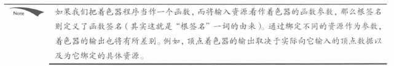
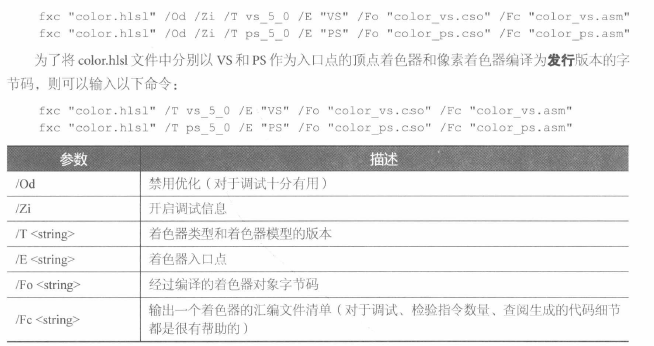

# 顶点与输入布局

顶点结构体，需要提供D3D 输入布局描述 input layout description，如何处理结构体中的每个成员

```C++
struct Vertex1
{
    XMFLOAT3 Pos;
    XMFLOAT4 Color;
};
struct Vertex2
{
    XMFLOAT3 Pos;
    XMFLOAT3 Normal;
    XMFLOAT2 Tex0;
    XMFLOAT2 Tex1;
};
// 由element，也就是顶点有多少属性，就有多少个element的描述
typedef struct D3D12_INPUT_LAYOUT_DESC
{
    const D3D12_INPUT_ELEMENT_DESC *pInputElementDescs;
    UINT NumElements;
} D3D12_INPUT_LAYOUT_DESC;

typedef struct D3D12_INPUT_ELEMENT_DESC
{
    LPCSTR SemanticName;
    UINT SemanticIndex;
    DXGI_FORMAT Format;
    UINT InputSlot;
    UINT AlignedByteOffset;
    D3D12_INPUT_CLASSIFICATION InputSlotClass;
    UINT InstanceDataStepRate;
} D3D12_INPUT_ELEMENT_DESC;

D3D12_INPUT_ELEMENT_DESC desc1[] =
{
    {“POSITION”, 0, DXGI_FORMAT_R32G32B32_FLOAT, 0, 0, D3D12_INPUT_PER_VERTEX_DATA, 0},
    {“COLOR”, 0, DXGI_FORMAT_R32G32B32A32_FLOAT, 0, 12, D3D12_INPUT_PER_VERTEX_DATA, 0}
};
D3D12_INPUT_ELEMENT_DESC desc2[] =
{
    {“POSITION”, 0, DXGI_FORMAT_R32G32B32_FLOAT, 0, 0, D3D12_INPUT_PER_VERTEX_DATA, 0},
    {“NORMAL”, 0, DXGI_FORMAT_R32G32B32_FLOAT, 0, 12, D3D12_INPUT_PER_VERTEX_DATA, 0},
    {“TEXCOORD”, 0, DXGI_FORMAT_R32G32_FLOAT, 0, 24, D3D12_INPUT_PER_VERTEX_DATA, 0}
    {“TEXCOORD”, 1, DXGI_FORMAT_R32G32_FLOAT, 0, 32, D3D12_INPUT_PER_VERTEX_DATA, 0}
};
```

1. Semantic Name：一个元素相关联的特定字符串，表达了该元素的预期用途。可以将顶点结构体中的元素与顶点着色器输入签名（vertex shader input signature）中的元素一一映射

2. SemanticIndex：附加到语义上的索引，区分相同的semantic，未加索引默认为0。比如TEXCOORDn

3. Format：DXGI_FORMAT成员指定顶点元素的格式
   

4. InputSlot：指定传递元素所用的input slot index。D3D支持16个slot，可以通过这16个slot向IA阶段输入vertex

5. AlignedByOffset：单个slot中，顶点结构地的首地址到某个元素起始地址的偏移

   ```c++
   struct Vertex2
   {
       XMFLOAT3 Pos; // 0-byte offset
       XMFLOAT3 Normal; // 12-byte offset
       XMFLOAT2 Tex0; // 24-byte offset
       XMFLOAT2 Tex1; // 32-byte offset
   };
   ```
6. InputSlotClass：D3D12_INPUT_CLASSIFICATION_PERVERTEX_DATA
   D3D12_INPUT_CLASSIFICATION_PER_INSTANCE_DATA（用于instancing）
7. InstanceDataStepRate：0，需要实例化就为1

   

# 顶点缓冲区

GPU访问顶点需要从Buffer这一类（ID3D12Resource）里，储存顶点的缓冲区叫做 vertex buffer

1. D3D12_Resource_DESC描述缓冲区资源
2. ID3D12Device::CreateCommittedResource 创建resource对象

```c++
// 简化缓冲区描述过程的构造函数
static inline CD3DX12_RESOURCE_DESC Buffer(
UINT64 width,
D3D12_RESOURCE_FLAGS flags = D3D12_RESOURCE_FLAG_NONE,
UINT64 alignment = 0 )
{
    return CD3DX12_RESOURCE_DESC(
        D3D12_RESOURCE_DIMENSION_BUFFER,
        alignment, width, 1, 1, 1,
        DXGI_FORMAT_UNKNOWN, 1, 0,
        D3D12_TEXTURE_LAYOUT_ROW_MAJOR, flags );
}
```

Width：缓冲区所占字节数，也就是所有的数据大小
静态几何体，每一帧都不会发生改变的几何体，buffer会放在D3D12_HEAP_TYPE_DEFAULT中优化性能
堆的问题是CPU不能向默认堆中写入数据，如何初始化顶点缓冲区

上传缓冲区域（upload buffer）：D3D12_HEAP_TYPE_UPLOAD
内存->复制到上传缓冲区-> 复制到顶点缓冲区

```C++
Microsoft::WRL::ComPtr<ID3D12Resource> d3dUtil::CreateDefaultBuffer(
ID3D12Device* device, ID3D12GraphicsCommandList* cmdList, const void* initData,
UINT64 byteSize, Microsoft::WRL::ComPtr<ID3D12Resource>& uploadBuffer)
{
	ComPtr<ID3D12Resource> defaultBuffer;
	//创建实际的默认缓冲区资源
    ThrowIfFailed(device->CreateCommittedResource(
        &CD3DX12_HEAP_PROPERTIES(D3D12_HEAP_TYPE_DEFAULT),
        	D3D12_HEAP_FLAG_NONE,
        &CD3DX12_RESOURCE_DESC::Buffer(byteSize),
        	D3D12_RESOURCE_STATE_COMMON,
        nullptr,
        IID_PPV_ARGS(defaultBuffer.GetAddressOf())));
    
	// 创建一个upload buffer 
    ThrowIfFailed(device->CreateCommittedResource(
        &CD3DX12_HEAP_PROPERTIES(D3D12_HEAP_TYPE_UPLOAD),
        	D3D12_HEAP_FLAG_NONE,
        &CD3DX12_RESOURCE_DESC::Buffer(byteSize),
        	D3D12_RESOURCE_STATE_GENERIC_READ,
        nullptr,
        IID_PPV_ARGS(uploadBuffer.GetAddressOf())));
    
	// 描述希望复制到默认缓冲区中的内容
    D3D12_SUBRESOURCE_DATA subResourceData = {};
    subResourceData.pData = initData;
    subResourceData.RowPitch = byteSize;
    subResourceData.SlicePitch = subResourceData.RowPitch;

    // 数据复制到默认缓冲区资源的流程
	// UpdataSubresource辅助函数会先将数据从CPU端的内存复制到upload堆里接着
	// 再通过调用ID3D12CommandList::CopySubresourceRegion函数，把上传堆内的数据复制到mBuffer中
	// 资源状态转换，资源用作复制操作中的目标。这是一种只写状态。
    cmdList->ResourceBarrier(1,	&CD3DX12_RESOURCE_BARRIER::Transition(defaultBuffer.Get(),
		D3D12_RESOURCE_STATE_COMMON, D3D12_RESOURCE_STATE_COPY_DEST));
    // 复制到default buffer中
    UpdateSubresources<1>(cmdList, defaultBuffer.Get(), uploadBuffer.Get(),	0, 0, 1, &subResourceData);
	// 转换资源状态，从copy到GENERIC_READ，是其他读取状态位的逻辑 OR 组合，这是上传堆所需的启动状态
    cmdList->ResourceBarrier(1, &CD3DX12_RESOURCE_BARRIER::Transition(defaultBuffer.Get(),
		D3D12_RESOURCE_STATE_COPY_DEST, D3D12_RESOURCE_STATE_GENERIC_READ));
	
    //上述函数调用后，需要保证upload buffer函数依旧存在，不能销毁，需要等到list中的复制操作执行
	// 调用得知完成复制的消息后，才能释放uploadbuffer
	return defaultBuffer;
}

typedef struct D3D12_SUBRESOURCE_DATA
{
    const void *pData; // 指向某个系统内存块的指针，有初始化缓冲区的数据，
    LONG_PTR RowPitch;
    LONG_PTR SlicePitch;
} D3D12_SUBRESOURCE_DATA;

//创建缓冲区示例：
Vertex vertices[] =
{	// pos color
    { XMFLOAT3(-1.0f, -1.0f, -1.0f), XMFLOAT4(Colors::White) },
    { XMFLOAT3(-1.0f, +1.0f, -1.0f), XMFLOAT4(Colors::Black) },
    { XMFLOAT3(+1.0f, +1.0f, -1.0f), XMFLOAT4(Colors::Red) },
    { XMFLOAT3(+1.0f, -1.0f, -1.0f), XMFLOAT4(Colors::Green) },
    { XMFLOAT3(-1.0f, -1.0f, +1.0f), XMFLOAT4(Colors::Blue) },
    { XMFLOAT3(-1.0f, +1.0f, +1.0f), XMFLOAT4(Colors::Yellow) },
    { XMFLOAT3(+1.0f, +1.0f, +1.0f), XMFLOAT4(Colors::Cyan) },
    { XMFLOAT3(+1.0f, -1.0f, +1.0f), XMFLOAT4(Colors::Magenta) }
};

const UINT64 vbByteSize = 8 * sizeof(Vertex);
ComPtr<ID3D12Resource> VertexBufferGPU = nullptr;
ComPtr<ID3D12Resource> VertexBufferUploader = nullptr;
VertexBufferGPU = d3dUtil::CreateDefaultBuffer(md3dDevice.Get(),
	mCommandList.Get(), vertices, vbByteSize,
	VertexBufferUploader);

```

vertex buffer绑定到渲染流水线上，创建 vertex buffer view，无需创建 descriptor heap

```C++
typedef struct D3D12_VERTEX_BUFFER_VIEW
{
    D3D12_GPU_VIRTUAL_ADDRESS BufferLocation; // vertex buffer资源的虚拟地址，通过				ID3D12Resource::GetGPUVirtualAddress获取
    UINT SizeInBytes; // vertex 缓冲区大小
    UINT StrideInBytes; // 每个顶点元素的大小
} D3D12_VERTEX_BUFFER_VIEW;
```

View创建完成后，可以将它和pipeline上的一个 input slot绑定

```C++
void ID3D12GraphicsCommandList::IASetVertexBuffers(
    UINT StartSlot, // 绑定多个顶点缓冲区是，所用的slot，0-15
    UINT NumBuffers, // 输入槽绑定的顶点缓冲区数量，如果起始输入槽StartSlot为K，绑定n个缓冲区，那么就会依次绑定，直到k+nslot
    const D3D12_VERTEX_BUFFER_VIEW *pViews); // vertex buffer view数组，

D3D12_VERTEX_BUFFER_VIEW vbv;
    vbv.BufferLocation = VertexBufferGPU->GetGPUVirtualAddress();
    vbv.StrideInBytes = sizeof(Vertex);
    vbv.SizeInBytes = 8 * sizeof(Vertex);
D3D12_VERTEX_BUFFER_VIEW vertexBuffers[1] = { vbv };
mCommandList->IASetVertexBuffers(0, 1, vertexBuffers);
```

如果不对顶点缓冲区做任何修改，会一直绑定在对应的input slot上

```C++
ID3D12Resource* mVB1; // stores vertices of type Vertex1
ID3D12Resource* mVB2; // stores vertices of type Vertex2
D3D12_VERTEX_BUFFER_VIEW_DESC mVBView1; // view to mVB1
D3D12_VERTEX_BUFFER_VIEW_DESC mVBView2; // view to mVB2
/*…Create the vertex buffers and views…*/
mCommandList->IASetVertexBuffers(0, 1, &VBView1);
/* …draw objects using vertex buffer 1… */
mCommandList->IASetVertexBuffers(0, 1, &mVBView2);
/* …draw objects using vertex buffer 2… */
```

将vertex buffer设置到 slot并不会执行实际上的绘制操作，只是搭建好流程。需要DrawInstanced绘制顶点

```C++
void ID3D12CommandList::DrawInstanced(
    UINT VertexCountPerInstance, //每个instance需要绘制的顶点数量
    UINT InstanceCount, // instancing合批的技术，目前只有单个批次
    UINT StartVertexLocation, // vertex buffer第一个被绘制顶点的 index，一般是0
    UINT StartInstanceLocation); // 暂时设置为0
// 单独图元的拓扑结构
cmdList->IASetPrimitiveTopology(D3D_PRIMITIVE_TOPOLOGY_TRIANGLELIST)
```


# index 和 index buffer

GPU的资源缓冲区，也就是ID3D12Resource内，之前的CreateDefaultBuffer没有指定参数类型，所以也可以用来创建indexbuffer
绑定需要 index buffer view

```C++
typedef struct D3D12_INDEX_BUFFER_VIEW
{
    D3D12_GPU_VIRTUAL_ADDRESS BufferLocation; // index buffer 虚拟地址
    UINT SizeInBytes; // index buffer 大小
    DXGI_FORMAT Format; // 需要DXGI_FORMAT_R16_UINT 或 DXGI_FORMAT_R32_UINT
} D3D12_INDEX_BUFFER_VIEW;
```

缓冲区绑定渲染管线，ID3D12GraphicsCommandList::IASetIndexBuffer

```c++
std::uint16_t indices[] = {
// front face
0, 1, 2,
0, 2, 3,
// back face
4, 6, 5,
4, 7, 6,
// left face
4, 5, 1,
4, 1, 0,
// right face
3, 2, 6,
3, 6, 7,
// top face
1, 5, 6,
1, 6, 2,
// bottom face
4, 0, 3,
4, 3, 7
};

const UINT ibByteSize = 36 * sizeof(std::uint16_t);
ComPtr<ID3D12Resource> IndexBufferGPU = nullptr;
ComPtr<ID3D12Resource> IndexBufferUploader = nullptr;
IndexBufferGPU = d3dUtil::CreateDefaultBuffer(md3dDevice.Get(),
    mCommandList.Get(), indices), ibByteSize,
    IndexBufferUploader);

D3D12_INDEX_BUFFER_VIEW ibv;
ibv.BufferLocation = IndexBufferGPU->GetGPUVirtualAddress();
ibv.Format = DXGI_FORMAT_R16_UINT;
ibv.SizeInBytes = ibByteSize;

mCommandList->IASetIndexBuffer(&ibv);

void ID3D12GraphicsCommandList::DrawIndexedInstanced(
UINT IndexCountPerInstance, // 每个示例将要绘制的索引数量
UINT InstanceCount, // instance, 数量
UINT StartIndexLocation, // 指向所赢取的某个元素，标记为欲读取的其实缩影
INT BaseVertexLocation, // 偏移，本次绘制调用前，每个索引都加这个值
UINT StartInstanceLocation); // 暂时设置为0
```

使用index 需要使用方法 DrawIndexedInstance，替换DrawInstanced


目标就是合并不同物体的多个buffer成一个，减少buffer的绑定数量，绘制的时候可以用一个buffer来绘制

```C++
mCmdList->DrawIndexedInstanced(numSphereIndices, 1, 0, 0, 0);
mCmdList->DrawIndexedInstanced(numBoxIndices, 1, firstBoxIndex, firstBoxVertexPos,0);
mCmdList->DrawIndexedInstanced(numCylIndices, 1, firstCylIndex, firstCylVertexPos,0);
```


# 顶点着色器示例

如果没有几何着色器，顶点着色器必须使用SV_POSITION来输出顶点在 齐次剪裁空间（homogeneous space） 的位置
一般只能实现投影矩阵这一个环节

1. CPP 一定要输入与顶点着色器格式相匹配的数据
2. CPP 可以输入前面所有匹配数据，多的数据可以额外输入，但是没有用
3. 类型可以不同，比如 float 和 int，D3D允许对register中的数据重新解释，会有警告

 

# 像素着色器示例

像素片段与像素不同，pixel fragment是处理图像的基本单位，pixel fragment可能被clip或者DS比较丢弃，pixel是最后输出的唯一。在确定后台缓冲区某一个pixel的过程中，可能有多个pixel fragment

提前 深度测试、early-z rejection，不通过测试就不进行绘制。但是如果是需要绘制后保留，就需要先绘制在比较


# 常量缓冲区

constant buffer也是一种GPU资源（ID3D12Resource）
常量缓冲区通常由CPU每帧更新一次，所以constant buffer创建在upload heap中而非 default heap中，CPU可以更新
Constant buffer对硬件有要求，大小必须是硬件最小分配空间（256B）的整数倍

```C++
struct ObjectConstants
{
    DirectX::XMFLOAT4X4 WorldViewProj = MathHelper::Identity4x4();
};
// 创建缓冲区资源，利用它存储 NumElements 个常量缓冲区
UINT mElementByteSize = d3dUtil::CalcConstantBufferByteSize(sizeof(ObjectConstants));
// 可以认为mUploadCBuffer中存放了一个ObjectConstants类型的constant buffer 数组
// Constant Buffer View绑定到 存有物体相应常量数据的缓冲区子区域 
ComPtr<ID3D12Resource> mUploadCBuffer;
device->CreateCommittedResource(&CD3DX12_HEAP_PROPERTIES(D3D12_HEAP_TYPE_UPLOAD),
	D3D12_HEAP_FLAG_NONE,
	&CD3DX12_RESOURCE_DESC::Buffer(mElementByteSize * NumElements),
	D3D12_RESOURCE_STATE_GENERIC_READ,
	nullptr,
	IID_PPV_ARGS(&mUploadCBuffer));

UINT d3dUtil::CalcConstantBufferByteSize(UINTbyteSize)
{
   	// 凑整满足最小的256的整数倍，byte size + 255
    // 屏蔽求和结果低于2字节
    // (300 + 255) & ~255 // 按位取反
    // 555 & ~255
    // 0x022B & ~0x00ff 
    // 0x022B & 0ff00 // 按位与
    // 0x0200 = 512
	return (byteSize + 255) & ˜255;
}
```

HLSL中会隐式的填充位256B
D3D12的特殊语法，通过结构体声明，而不是cbuffef进行声明// 没啥必要的语法

```C++
struct ObjectConstants
{
    float4x4 gWorldViewProj;
    uint matIndex;
};
ConstantBuffer<ObjectConstants> gObjConstants : register(b0);

uint index = gObjConstants.matIndex;
```

更新常量缓冲区

需要获取 指向更新资源数据的指针

```c++
// Map方法，用于获取指向 需要更新资源数据的指针。还有一个拒绝GPU访问的作用
ComPtr<ID3D12Resource> mUploadBuffer;
BYTE* mMappedData = nullptr;

// 第一个参数是SubResource资源的索引，对于缓冲区来说有且仅有一个，所以是0
// 第二个可选项，指向D3D12_RANGE 描述内存的映射范围，空，是整个资源映射
// 双重指针，返回 需要映射资源数据的目标内存块
mUploadBuffer->Map(0, nullptr,reinterpret_cast<void**>(&mMappedData));

// memcpy从 系统内存复制到常量缓冲区，CPU将数据从内存拷贝到GPU
memcpy(mMappedData, &data, dataSizeInBytes);

//更新完成后，释放映射内存前需要 unmap 取消映射，清除指针+启动GPU的访问权限
if(mUploadBuffer != nullptr)
    mUploadBuffer->Unmap(0, nullptr); // subresource资源 + 内存范围映射
mMappedData = nullptr;
```

上传缓冲区辅助函数

工程问题，包装，uploadbuffer构造、析构函数，处理资源映射，取消映射操作，CopyData更新缓冲区内的元素

```c++
template<typename T>
class UploadBuffer
{
public:
    // uploadbuffer可以用于其他用途，比如顶点缓冲区的更新
    // isConstantBuffer 用于区分是否是constantbuffer
    UploadBuffer(ID3D12Device* device, UINT elementCount, bool isConstantBuffer) : 
        mIsConstantBuffer(isConstantBuffer)
    {
        mElementByteSize = sizeof(T);

        // Cbuffer必须是256的倍数，
        // typedef struct D3D12_CONSTANT_BUFFER_VIEW_DESC {
        // UINT64 OffsetInBytes; // 偏移 256整数倍 (内存偏移)
        // UINT   SizeInBytes;   // 数据大小 256整数倍
        // } D3D12_CONSTANT_BUFFER_VIEW_DESC;
        if(isConstantBuffer)
            mElementByteSize = d3dUtil::CalcConstantBufferByteSize(sizeof(T));

        ThrowIfFailed(device->CreateCommittedResource(
            &CD3DX12_HEAP_PROPERTIES(D3D12_HEAP_TYPE_UPLOAD),
            D3D12_HEAP_FLAG_NONE,
            &CD3DX12_RESOURCE_DESC::Buffer(mElementByteSize*elementCount),
			D3D12_RESOURCE_STATE_GENERIC_READ,
            nullptr,
            IID_PPV_ARGS(&mUploadBuffer)));

        ThrowIfFailed(mUploadBuffer->Map(0, nullptr, reinterpret_cast<void**>(&mMappedData)));
        // 只要修改资源就不需要取消map
        // 资源被GPU试用期间，不能向资源进行写操作，需要同步 list queue
    }
    UploadBuffer(const UploadBuffer& rhs) = delete;
    UploadBuffer& operator=(const UploadBuffer& rhs) = delete;
    ~UploadBuffer()
    {
        if(mUploadBuffer != nullptr)
            mUploadBuffer->Unmap(0, nullptr);
        mMappedData = nullptr;
    }

    ID3D12Resource* Resource()const
    {
        return mUploadBuffer.Get();
    }
	// 系统内存复制到常量缓冲区
    void CopyData(int elementIndex, const T& data)
    {
        memcpy(&mMappedData[elementIndex*mElementByteSize], &data, sizeof(T));
    }

private:
    Microsoft::WRL::ComPtr<ID3D12Resource> mUploadBuffer;
    BYTE* mMappedData = nullptr;
    UINT mElementByteSize = 0;
    bool mIsConstantBuffer = false;
};
```

示例：每一帧更具鼠标移动更新，world view projection 矩阵

```c++
void BoxApp::OnMouseMove(WPARAM btnState, int x, inty)
{
    if((btnState & MK_LBUTTON) != 0)
    {
        // 根据鼠标的移动距离计算旋转角度，每个像素按照此角度的1/4进行旋转
        float dx = XMConvertToRadians(0.25f*static_cast<float> (x - mLastMousePos.x));
        float dy = XMConvertToRadians(0.25f*static_cast<float> (y - mLastMousePos.y));
        // 鼠标输入更新摄像机绕立方体旋转的角度
        mTheta += dx;
        mPhi += dy;
        // 限制mpi的范围
        mPhi = MathHelper::Clamp(mPhi, 0.1f, MathHelper::Pi - 0.1f);
    }
    else if((btnState & MK_RBUTTON) != 0)
    {
        // 场景中的每个像素 按鼠标移动距离的0.005倍进行缩放
        float dx = 0.005f*static_cast<float>(x - mLastMousePos.x);
        float dy = 0.005f*static_cast<float>(y - mLastMousePos.y);
        // 鼠标的输入更新摄像机的可视半径
        mRadius += dx - dy;
        // 限制可视半径范围
        mRadius = MathHelper::Clamp(mRadius, 3.0f, 15.0f);
    }
    mLastMousePos.x = x;
    mLastMousePos.y = y;
}

void BoxApp::Update(const GameTimer& gt)
{
    // 球面坐标 转到 笛卡尔坐标(xyz)
    float x = mRadius*sinf(mPhi)*cosf(mTheta);
    float z = mRadius*sinf(mPhi)*sinf(mTheta);
    float y = mRadius*cosf(mPhi);
    // 构建观察矩阵
    XMVECTOR pos = XMVectorSet(x, y, z, 1.0f);
    XMVECTOR target = XMVectorZero();
    XMVECTOR up = XMVectorSet(0.0f, 1.0f, 0.0f, 0.0f);
    XMMATRIX view = XMMatrixLookAtLH(pos, target, up);
    XMStoreFloat4x4(&mView, view);
    XMMATRIX world = XMLoadFloat4x4(&mWorld);
    XMMATRIX proj = XMLoadFloat4x4(&mProj);
    XMMATRIX worldViewProj = world*view*proj;
    // 更新 cbuffer
    ObjectConstants objConstants;
    XMStoreFloat4x4(&objConstants.WorldViewProj, XMMatrixTranspose(WorldViewProj));
    // mObjectCB 指针
    mObjectCB->CopyData(0, objConstants);
}
```

常量缓冲区描述符

存放在：D3D12_DESCRIPTOR_HEAP_TYPE_CBV_SRV_UAV  混合堆，可以存放constant buffer，shader，unordered access

```c++
D3D12_DESCRIPTOR_HEAP_DESC cbvHeapDesc;
cbvHeapDesc.NumDescriptors = 1;
cbvHeapDesc.Type = D3D12_DESCRIPTOR_HEAP_TYPE_CBV_SRV_UAV;
// 区别，指示它绑定到命令列表以供着色器引用
cbvHeapDesc.Flags = D3D12_DESCRIPTOR_HEAP_FLAG_SHADER_VISIBLE;
cbvHeapDesc.NodeMask = 0;
ComPtr<ID3D12DescriptorHeap> mCbvHeap
md3dDevice->CreateDescriptorHeap(&cbvHeapDesc, IID_PPV_ARGS(&mCbvHeap));

struct ObjectConstants
{
    XMFLOAT4X4 WorldViewProj = MathHelper::Identity4x4();
};
// 常量缓冲区存放了绘制n个物体需要的常量数据
std::unique_ptr<UploadBuffer<ObjectConstants>>
mObjectCB = nullptr;
mObjectCB =std::make_unique<UploadBuffer<ObjectConstants>>(md3dDevice.Get(), n, true);
UINT objCBByteSize = d3dUtil::CalcConstantBufferByteSize(sizeof(ObjectConstants));
// 缓冲区的起始地址
D3D12_GPU_VIRTUAL_ADDRESS cbAddress = mObjectCB->Resource()->GetGPUVirtualAddress();
// 偏移到常量缓冲区中绘制第i个物体的数据
int boxCBufIndex = i;
cbAddress += boxCBufIndex*objCBByteSize;

// heap -> 缓冲区描述实例 ->创建 view
// View描述的是绑定到 hlsl cbuffer的资源子集
D3D12_CONSTANT_BUFFER_VIEW_DESC cbvDesc;
cbvDesc.BufferLocation = cbAddress;
cbvDesc.SizeInBytes = d3dUtil::CalcConstantBufferByteSize(sizeof(ObjectConstants));
md3dDevice->CreateConstantBufferView(&cbvDesc, mCbvHeap->GetCPUDescriptorHandleForHeapStart());
```

RootSignature 和 描述符表

资源绑定到 reader pipeline = 不同类型的资源，绑定到特定的 寄存器槽，register slot
常量缓冲区b0，纹理t0，采样器s0

Root Signature：执行绘制命令前，已经被绑定pipeline的资源，映射到着色器对应输入寄存器
签名需要与使用它的做着色器兼容：根签名需要为Shader提供所有需要绑定的资源

ID3D12RootSignature，描述绘制调用过程中Shader所需资源的root parameter定义
Parameter可以是 root constant，root descriptor，或者 descriptor table

```C++
// 参数类型可以是常数，描述或者描述符表
CD3DX12_ROOT_PARAMETER slotRootParameter[1];
// 创建一个 只有一个 CBV 的描述符表
CD3DX12_DESCRIPTOR_RANGE cbvTable;
// table type，描述符数量，描述符区域绑定到base shader register,绑定到b0
cbvTable.Init(D3D12_DESCRIPTOR_RANGE_TYPE_CBV,1, 0);
// 描述符数量，指向描述符表的指针
slotRootParameter[0].InitAsDescriptorTable(1, &cbvTable);

// Root Signature 由 array of root parameter 构成
CD3DX12_ROOT_SIGNATURE_DESC rootSigDesc(1, slotRootParameter, 0, nullptr,
D3D12_ROOT_SIGNATURE_FLAG_ALLOW_INPUT_ASSEMBLER_INPUT_LAYOUT);

// 创建仅包含一个slot的rootsignature，slot指向仅由 单个cbuffer组成的 描述符区域
ComPtr<ID3DBlob> serializedRootSig = nullptr;
ComPtr<ID3DBlob> errorBlob = nullptr;

HRESULT hr = D3D12SerializeRootSignature(&rootSigDesc,
	D3D_ROOT_SIGNATURE_VERSION_1,
	serializedRootSig.GetAddressOf(), 
//D3D12规定，必须先将 Root Signature 的 描述符布局进行 serialize，待其转化为以ID3DBlob接口表示的序列化数据格式后，传入CreateSignature 创建Root Signature                                        
	errorBlob.GetAddressOf());

ThrowIfFailed(md3dDevice->CreateRootSignature( 0,
	serializedRootSig->GetBufferPointer(),
	serializedRootSig->GetBufferSize(),
	IID_PPV_ARGS(&mRootSignature)));
```

Root Signature 只是说明绑定，而非有具体的绑定操作。command list先设置好根签名，然后再set绑定描述符表

```c++
void ID3D12GraphicsCommandList::SetGraphicsRootDescriptorTable(
    UINT RootParameterIndex, // 根参数按照此 index(想要绑定的register slot编号)进行设置
	D3D12_GPU_DESCRIPTOR_HANDLE BaseDescriptor); //Table中第一个 描述符在描述符堆中的句柄

mCommandList->SetGraphicsRootSignature(mRootSignature.Get());
ID3D12DescriptorHeap* descriptorHeaps[] = { mCbvHeap.Get() };
mCommandList->SetDescriptorHeaps(_countof(descriptorHeaps), descriptorHeaps);
// 偏移到此次绘制所需要的CBV处
CD3DX12_GPU_DESCRIPTOR_HANDLE cbv(mCbvHeap - >GetGPUDescriptorHandleForHeapStart());
cbv.Offset(cbvIndex, mCbvSrvUavDescriptorSize);
mCommandList->SetGraphicsRootDescriptorTable(0, cbv);
```

1. Root Signature的规模尽量小，减少每帧渲染过程中 root signature的修改次数
2. Draw绘制调用，或计算调度(分派)dispatch中，有 root signature的内容发生改变时，D3D12会自动更新 root signature的呢绒为最新数据，每次draw和dispatch 都会产生一套独立的 signature 状态
3. 改了root signature会失去所有的绑定关系，修改后，需要按照新的root signature定义重新绑定资源到 render pipeline上


# 编译着色器

Shader-> 字节码 -> D3D编译成本针对当前GPU系统优化的本地指令ATI1

```C++
HRESULT D3DCompileFromFile(
LPCWSTR pFileName, // 编译HLSL扩展名的源代码文件
const D3D_SHADER_MACRO *pDefines, // 着色器宏的定义数组结构
ID3DInclude *pInclude, // 处理 include 相关的宏
LPCSTR pEntrypoint, // 着色器入口点函数名
LPCSTR pTarget, // shader版本，5.0 和 5.1
UINT Flags1, // 编译选项 D3DCOMPILE常量，D3DCOMPILE_DEBUG;D3DCOMPILE_SKIP_OPTIMIZATION
UINT Flags2, // 编译选项，本文默认为0
ID3DBlob **ppCode, // 指针存放编译好的字节码
ID3DBlob **ppErrorMsgs); // 报错字符串
```

ID3DBlob描述一段普通的内存块

1. LPVOID GetBufferPointer：返回数据 void*类型的指针，
2.  SIZE_T GetBufferSize： 返回缓冲区的字节大小

```C++
// 运行时编译
ComPtr<ID3DBlob> d3dUtil::CompileShader(
const std::wstring& filename,
const D3D_SHADER_MACRO* defines,
const std::string& entrypoint,
const std::string& target)
{
    // 若处于调试模式，则使用调试标志
    UINT compileFlags = 0;
#if defined(DEBUG) || defined(_DEBUG)
    compileFlags = D3DCOMPILE_DEBUG | D3DCOMPILE_SKIP_OPTIMIZATION;
#endif
    HRESULT hr = S_OK;
    
    ComPtr<ID3DBlob> byteCode = nullptr;
    ComPtr<ID3DBlob> errors;
    hr = D3DCompileFromFile(filename.c_str(), defines, D3D_COMPILE_STANDARD_FILE_INCLUDE,
    	entrypoint.c_str(), target.c_str(), compileFlags,
    	0, &byteCode, &errors);
    // 将错误信息输出到调试窗口
    if(errors != nullptr)
    	OutputDebugStringA((char*)errors->GetBufferPointer());
    ThrowIfFailed(hr);
    return byteCode;
}

// 编译 Shader VS PS的部分
ComPtr<ID3DBlob> mvsByteCode = nullptr;
ComPtr<ID3DBlob> mpsByteCode = nullptr;
mvsByteCode = d3dUtil::CompileShader(L”Shaders\color.hlsl”, nullptr, “VS”, “vs_5_0”);
mpsByteCode = d3dUtil::CompileShader(L”Shaders\color.hlsl”, nullptr, “PS”, “ps_5_0”);
```

离线编译
CSO：compiled shader object 已编译着色器对象
FXC：directX自带的命令行编译工具


引用CSO文件，跳过实时编译部分

```C++
// 标准文件输入机制读取二进制
ComPtr<ID3DBlob> d3dUtil::LoadBinary(const std::wstring& filename)
{
	std::ifstream fin(filename, std::ios::binary);
	fin.seekg(0, std::ios_base::end);
	std::ifstream::pos_type size = (int)fin.tellg();
	fin.seekg(0, std::ios_base::beg);
    
    ComPtr<ID3DBlob> blob;
	ThrowIfFailed(D3DCreateBlob(size,blob.GetAddressOf()));
	
    fin.read((char*)blob->GetBufferPointer(), size);
	fin.close();
	return blob;
}
// 直接拿到字节码
ComPtr<ID3DBlob> mvsByteCode = d3dUtil::LoadBinary(L”Shaders\color_vs.cso”);
ComPtr<ID3DBlob> mpsByteCode = d3dUtil::LoadBinary(L”Shaders\color_ps.cso”);
```

生成着色器汇编代码 FXC可以生成

Visual Studio 支持配置FXC自动编译HLSL，缺点仅允许每个文件中有一个Shader程序，也就是VS和PS不能共存

# 光栅器状态 rasterizer state

```c++
typedef struct D3D12_RASTERIZER_DESC {
D3D12_FILL_MODE FillMode; // Default: D3D12_FILL_SOLID
D3D12_CULL_MODE CullMode; // Default: D3D12_CULL_BACK
BOOL FrontCounterClockwise; // Default: false
INT DepthBias; // Default: 0
FLOAT DepthBiasClamp; // Default: 0.0f
FLOAT SlopeScaledDepthBias; // Default: 0.0f
BOOL DepthClipEnable; // Default: true
BOOL ScissorEnable; // Default: false
BOOL MultisampleEnable; // Default: false
BOOL AntialiasedLineEnable; // Default: false
UINT ForcedSampleCount; // Default: 0
// Default: D3D12_CONSERVATIVE_RASTERIZATION_MODE_OFF
D3D12_CONSERVATIVE_RASTERIZATION_MODE ConservativeRaster;
} D3D12_RASTERIZER_DESC;

//D3D12_DEFAULT 用于初始化成员 重载为默认值
CD3DX12_RASTERIZER_DESC rsDesc(D3D12_DEFAULT);
rsDesc.FillMode = D3D12_FILL_WIREFRAME;
rsDesc.CullMode = D3D12_CULL_NONE;
```

1. Fill mode：线框模式，实体模式渲染
2. CullMode： 剔除操作，剔除正面、背面、或者不剔除
3. FrontCounterClockwise：false，根据摄像机的观察视角，顺时针为正面，你是真伪反面，true，则相反


# 流水线状态对象 PSO

input layout view，VS，PS等等都可以看做是单条流水线的一部分状态，需要将这些对象绑定到pipeline上

```c++
typedef struct D3D12_GRAPHICS_PIPELINE_STATE_DESC
{ ID3D12RootSignature *pRootSignature;
D3D12_SHADER_BYTECODE VS;
D3D12_SHADER_BYTECODE PS;
D3D12_SHADER_BYTECODE DS;
D3D12_SHADER_BYTECODE HS;
D3D12_SHADER_BYTECODE GS;
D3D12_STREAM_OUTPUT_DESC StreamOutput;
D3D12_BLEND_DESC BlendState;
UINT SampleMask;
D3D12_RASTERIZER_DESC RasterizerState;
D3D12_DEPTH_STENCIL_DESC DepthStencilState;
D3D12_INPUT_LAYOUT_DESC InputLayout;
D3D12_PRIMITIVE_TOPOLOGY_TYPE PrimitiveTopologyType;
UINT NumRenderTargets;
DXGI_FORMAT RTVFormats[8];
DXGI_FORMAT DSVFormat;
DXGI_SAMPLE_DESC SampleDesc;
} D3D12_GRAPHICS_PIPELINE_STATE_DESC;
```

1. 指向一个与PSO绑定 Root Signature指针，与Shader兼容

2.  VS - PS - DS - HS - GS，Shader绑定，D3D12_SHADER_BYTECODE指定

   ```c++
   typedef struct D3D12_SHADER_BYTECODE {
   const BYTE *pShaderBytecode;  //  指向字节码数据的指针
   SIZE_T BytecodeLength;  // 字节码数据的大小
   } D3D12_SHADER_BYTECODE;
   ```

3. Steam Output：流式输出，暂时清空。需要用[D3D12_STREAM_OUTPUT_DESC](https://learn.microsoft.com/zh-cn/windows/win32/api/d3d12/ns-d3d12-d3d12_stream_output_desc)

4. Blend State：混合操作状态 [D3D12_BLEND_DESC](https://learn.microsoft.com/zh-cn/windows/win32/api/d3d12/ns-d3d12-d3d12_blend_desc)

5. SampleMask： 多重采样点位采样情况（D3D文档是blend state的mask）

6. RasterizerState：光栅化阶段状态

7. DepthStencilState：深度缓冲区状态

8. InputLayout： 输入的布局描述

9. PrimitiveTopologyType：图元拓扑类型

10.  NumRenderTargets：同时所用的RT的数量，RTVFormats

11.  DSVFormat： DS格式

12.  SampleDesc：描述多重采样对每个像素采样的数量和质量级别

```c++
ComPtr<ID3D12RootSignature> mRootSignature;
std::vector<D3D12_INPUT_ELEMENT_DESC> mInputLayout;
ComPtr<ID3DBlob> mvsByteCode;
ComPtr<ID3DBlob> mpsByteCode;
… 
D3D12_GRAPHICS_PIPELINE_STATE_DESC psoDesc;
ZeroMemory(&psoDesc, sizeof(D3D12_GRAPHICS_PIPELINE_STATE_DESC));
psoDesc.InputLayout = { mInputLayout.data(), (UINT)mInputLayout.size() };
psoDesc.pRootSignature = mRootSignature.Get();

psoDesc.VS =
{
    reinterpret_cast<BYTE*>(mvsByteCode-
    >GetBufferPointer()),
    mvsByteCode->GetBufferSize()
};

psoDesc.PS =
{
    reinterpret_cast<BYTE*>(mpsByteCode-
    >GetBufferPointer()),
    mpsByteCode->GetBufferSize()
};
psoDesc.RasterizerState = CD3D12_RASTERIZER_DESC(D3D12_DEFAULT);
psoDesc.BlendState = CD3D12_BLEND_DESC(D3D12_DEFAULT);
psoDesc.DepthStencilState = CD3D12_DEPTH_STENCIL_DESC(D3D12_DEFAULT);
psoDesc.SampleMask = UINT_MAX;
psoDesc.PrimitiveTopologyType = D3D12_PRIMITIVE_TOPOLOGY_TYPE_TRIANGLE;
psoDesc.NumRenderTargets = 1;
psoDesc.RTVFormats[0] = mBackBufferFormat;
psoDesc.SampleDesc.Count = m4xMsaaState ? 4 : 1;
psoDesc.SampleDesc.Quality = m4xMsaaState ? (m4xMsaaQuality - 1) : 0;
psoDesc.DSVFormat = mDepthStencilFormat;
ComPtr<ID3D12PipelineState> mPSO;
md3dDevice->CreateGraphicsPipelineState(&psoDesc, IID_PPV_ARGS(&mPSO)));
```

D3D11中是分开配置的，没有总体设置的，驱动程序可能为了一个相关的独立状态对硬件重新进行编程
D3D12中变为一个集合，这个集合的好处是提升前生成硬件的本地指令和状态

PSO的验证、创建操作比较花费时间，初始化期间生成PSO，第一次引用，之都存在哈希表集合中

并非所有的状态都会封装在PSO内，比如viewport，scissor rectangle剪裁矩形
D3D本身是个状态机，保持各自的状态

PSO与command list绑定，在设置另一个PSO或者重置list之前，会一直延续当前PSO
性能就是PSO切换最小次数原则，尽量使用相同的PSO绘制物体

# 几何体图形辅助结构体

定义一些常用的几何操作

```C++
// 提供vertex buffer，index buffer中单个几何体绘制需要的数据和偏移量
struct SubmeshGeometry
{
    UINT IndexCount = 0;
    UINT StartIndexLocation = 0;
    INT BaseVertexLocation = 0;
    // 包围盒
    DirectX::BoundingBox Bounds;
};

struct MeshGeometry
{
    // 名称
    std::string Name;
    
    //系统内存中的副本。 泛型，等到使用时转换为合适的类型
    Microsoft::WRL::ComPtr<ID3DBlob> VertexBufferCPU = nullptr;
    Microsoft::WRL::ComPtr<ID3DBlob> IndexBufferCPU = nullptr;

    Microsoft::WRL::ComPtr<ID3D12Resource> VertexBufferGPU = nullptr;
    Microsoft::WRL::ComPtr<ID3D12Resource> IndexBufferGPU = nullptr;
    Microsoft::WRL::ComPtr<ID3D12Resource> VertexBufferUploader = nullptr;
    Microsoft::WRL::ComPtr<ID3D12Resource> IndexBufferUploader = nullptr;
    // buffer相关的数据，比如字节大小等
    UINT VertexByteStride = 0;
    UINT VertexBufferByteSize = 0;
    DXGI_FORMAT IndexFormat = DXGI_FORMAT_R16_UINT;
    UINT IndexBufferByteSize = 0;

    // 一个结构体 -> 一组index vertex buffer -> 多个几何体
    // 容器存放，单独绘制其中的子网格体
    std::unordered_map<std::string, SubmeshGeometry>	DrawArgs;
    
    D3D12_VERTEX_BUFFER_VIEW VertexBufferView()const
    {
        D3D12_VERTEX_BUFFER_VIEW vbv;
        vbv.BufferLocation = VertexBufferGPU-
        >GetGPUVirtualAddress();
        vbv.StrideInBytes = VertexByteStride;
        vbv.SizeInBytes = VertexBufferByteSize;
        return vbv;
    }
    
    D3D12_INDEX_BUFFER_VIEW IndexBufferView()const
    {
        D3D12_INDEX_BUFFER_VIEW ibv;
        ibv.BufferLocation = IndexBufferGPU-
        >GetGPUVirtualAddress();
        ibv.Format = IndexFormat;
        ibv.SizeInBytes = IndexBufferByteSize;
        return ibv;
    }
    // 带数据上传到GPU后，释放这些内存
    void DisposeUploaders()
    {
        VertexBufferUploader = nullptr;
        IndexBufferUploader = nullptr;
    }
};
```

