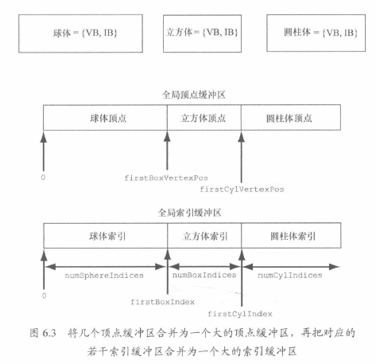

# 顶点与输入布局

顶点结构体，需要提供D3D 输入布局描述 input layout description，如何处理结构体中的每个成员

```C++
struct Vertex1
{
    XMFLOAT3 Pos;
    XMFLOAT4 Color;
};
struct Vertex2
{
    XMFLOAT3 Pos;
    XMFLOAT3 Normal;
    XMFLOAT2 Tex0;
    XMFLOAT2 Tex1;
};
// 由element，也就是顶点有多少属性，就有多少个element的描述
typedef struct D3D12_INPUT_LAYOUT_DESC
{
    const D3D12_INPUT_ELEMENT_DESC *pInputElementDescs;
    UINT NumElements;
} D3D12_INPUT_LAYOUT_DESC;

typedef struct D3D12_INPUT_ELEMENT_DESC
{
    LPCSTR SemanticName;
    UINT SemanticIndex;
    DXGI_FORMAT Format;
    UINT InputSlot;
    UINT AlignedByteOffset;
    D3D12_INPUT_CLASSIFICATION InputSlotClass;
    UINT InstanceDataStepRate;
} D3D12_INPUT_ELEMENT_DESC;

D3D12_INPUT_ELEMENT_DESC desc1[] =
{
    {“POSITION”, 0, DXGI_FORMAT_R32G32B32_FLOAT, 0, 0, D3D12_INPUT_PER_VERTEX_DATA, 0},
    {“COLOR”, 0, DXGI_FORMAT_R32G32B32A32_FLOAT, 0, 12, D3D12_INPUT_PER_VERTEX_DATA, 0}
};
D3D12_INPUT_ELEMENT_DESC desc2[] =
{
    {“POSITION”, 0, DXGI_FORMAT_R32G32B32_FLOAT, 0, 0, D3D12_INPUT_PER_VERTEX_DATA, 0},
    {“NORMAL”, 0, DXGI_FORMAT_R32G32B32_FLOAT, 0, 12, D3D12_INPUT_PER_VERTEX_DATA, 0},
    {“TEXCOORD”, 0, DXGI_FORMAT_R32G32_FLOAT, 0, 24, D3D12_INPUT_PER_VERTEX_DATA, 0}
    {“TEXCOORD”, 1, DXGI_FORMAT_R32G32_FLOAT, 0, 32, D3D12_INPUT_PER_VERTEX_DATA, 0}
};
```

1. Semantic Name：一个元素相关联的特定字符串，表达了该元素的预期用途。可以将顶点结构体中的元素与顶点着色器输入签名（vertex shader input signature）中的元素一一映射

2. SemanticIndex：附加到语义上的索引，区分相同的semantic，未加索引默认为0。比如TEXCOORDn

3. Format：DXGI_FORMAT成员指定顶点元素的格式
   

4. InputSlot：指定传递元素所用的input slot index。D3D支持16个slot，可以通过这16个slot向IA阶段输入vertex

5. AlignedByOffset：单个slot中，顶点结构地的首地址到某个元素起始地址的偏移

   ```c++
   struct Vertex2
   {
       XMFLOAT3 Pos; // 0-byte offset
       XMFLOAT3 Normal; // 12-byte offset
       XMFLOAT2 Tex0; // 24-byte offset
       XMFLOAT2 Tex1; // 32-byte offset
   };
   ```
6. InputSlotClass：D3D12_INPUT_CLASSIFICATION_PERVERTEX_DATA
   D3D12_INPUT_CLASSIFICATION_PER_INSTANCE_DATA（用于instancing）
7. InstanceDataStepRate：0，需要实例化就为1

   

# 顶点缓冲区

GPU访问顶点需要从Buffer这一类（ID3D12Resource）里，储存顶点的缓冲区叫做 vertex buffer

1. D3D12_Resource_DESC描述缓冲区资源
2. ID3D12Device::CreateCommittedResource 创建resource对象

```c++
// 简化缓冲区描述过程的构造函数
static inline CD3DX12_RESOURCE_DESC Buffer(
UINT64 width,
D3D12_RESOURCE_FLAGS flags = D3D12_RESOURCE_FLAG_NONE,
UINT64 alignment = 0 )
{
    return CD3DX12_RESOURCE_DESC(
        D3D12_RESOURCE_DIMENSION_BUFFER,
        alignment, width, 1, 1, 1,
        DXGI_FORMAT_UNKNOWN, 1, 0,
        D3D12_TEXTURE_LAYOUT_ROW_MAJOR, flags );
}
```

Width：缓冲区所占字节数，也就是所有的数据大小
静态几何体，每一帧都不会发生改变的几何体，buffer会放在D3D12_HEAP_TYPE_DEFAULT中优化性能
堆的问题是CPU不能向默认堆中写入数据，如何初始化顶点缓冲区

上传缓冲区域（upload buffer）：D3D12_HEAP_TYPE_UPLOAD
内存->复制到上传缓冲区-> 复制到顶点缓冲区

```C++
Microsoft::WRL::ComPtr<ID3D12Resource> d3dUtil::CreateDefaultBuffer(
ID3D12Device* device, ID3D12GraphicsCommandList* cmdList, const void* initData,
UINT64 byteSize, Microsoft::WRL::ComPtr<ID3D12Resource>& uploadBuffer)
{
	ComPtr<ID3D12Resource> defaultBuffer;
	//创建实际的默认缓冲区资源
    ThrowIfFailed(device->CreateCommittedResource(
        &CD3DX12_HEAP_PROPERTIES(D3D12_HEAP_TYPE_DEFAULT),
        	D3D12_HEAP_FLAG_NONE,
        &CD3DX12_RESOURCE_DESC::Buffer(byteSize),
        	D3D12_RESOURCE_STATE_COMMON,
        nullptr,
        IID_PPV_ARGS(defaultBuffer.GetAddressOf())));
    
	// 创建一个upload buffer 
    ThrowIfFailed(device->CreateCommittedResource(
        &CD3DX12_HEAP_PROPERTIES(D3D12_HEAP_TYPE_UPLOAD),
        	D3D12_HEAP_FLAG_NONE,
        &CD3DX12_RESOURCE_DESC::Buffer(byteSize),
        	D3D12_RESOURCE_STATE_GENERIC_READ,
        nullptr,
        IID_PPV_ARGS(uploadBuffer.GetAddressOf())));
    
	// 描述希望复制到默认缓冲区中的内容
    D3D12_SUBRESOURCE_DATA subResourceData = {};
    subResourceData.pData = initData;
    subResourceData.RowPitch = byteSize;
    subResourceData.SlicePitch = subResourceData.RowPitch;

    // 数据复制到默认缓冲区资源的流程
	// UpdataSubresource辅助函数会先将数据从CPU端的内存复制到upload堆里接着
	// 再通过调用ID3D12CommandList::CopySubresourceRegion函数，把上传堆内的数据复制到mBuffer中
	// 资源状态转换，资源用作复制操作中的目标。这是一种只写状态。
    cmdList->ResourceBarrier(1,	&CD3DX12_RESOURCE_BARRIER::Transition(defaultBuffer.Get(),
		D3D12_RESOURCE_STATE_COMMON, D3D12_RESOURCE_STATE_COPY_DEST));
    // 复制到default buffer中
    UpdateSubresources<1>(cmdList, defaultBuffer.Get(), uploadBuffer.Get(),	0, 0, 1, &subResourceData);
	// 转换资源状态，从copy到GENERIC_READ，是其他读取状态位的逻辑 OR 组合，这是上传堆所需的启动状态
    cmdList->ResourceBarrier(1, &CD3DX12_RESOURCE_BARRIER::Transition(defaultBuffer.Get(),
		D3D12_RESOURCE_STATE_COPY_DEST, D3D12_RESOURCE_STATE_GENERIC_READ));
	
    //上述函数调用后，需要保证upload buffer函数依旧存在，不能销毁，需要等到list中的复制操作执行
	// 调用得知完成复制的消息后，才能释放uploadbuffer
	return defaultBuffer;
}

typedef struct D3D12_SUBRESOURCE_DATA
{
    const void *pData; // 指向某个系统内存块的指针，有初始化缓冲区的数据，
    LONG_PTR RowPitch;
    LONG_PTR SlicePitch;
} D3D12_SUBRESOURCE_DATA;

//创建缓冲区示例：
Vertex vertices[] =
{	// pos color
    { XMFLOAT3(-1.0f, -1.0f, -1.0f), XMFLOAT4(Colors::White) },
    { XMFLOAT3(-1.0f, +1.0f, -1.0f), XMFLOAT4(Colors::Black) },
    { XMFLOAT3(+1.0f, +1.0f, -1.0f), XMFLOAT4(Colors::Red) },
    { XMFLOAT3(+1.0f, -1.0f, -1.0f), XMFLOAT4(Colors::Green) },
    { XMFLOAT3(-1.0f, -1.0f, +1.0f), XMFLOAT4(Colors::Blue) },
    { XMFLOAT3(-1.0f, +1.0f, +1.0f), XMFLOAT4(Colors::Yellow) },
    { XMFLOAT3(+1.0f, +1.0f, +1.0f), XMFLOAT4(Colors::Cyan) },
    { XMFLOAT3(+1.0f, -1.0f, +1.0f), XMFLOAT4(Colors::Magenta) }
};

const UINT64 vbByteSize = 8 * sizeof(Vertex);
ComPtr<ID3D12Resource> VertexBufferGPU = nullptr;
ComPtr<ID3D12Resource> VertexBufferUploader = nullptr;
VertexBufferGPU = d3dUtil::CreateDefaultBuffer(md3dDevice.Get(),
	mCommandList.Get(), vertices, vbByteSize,
	VertexBufferUploader);

```

vertex buffer绑定到渲染流水线上，创建 vertex buffer view，无需创建 descriptor heap

```C++
typedef struct D3D12_VERTEX_BUFFER_VIEW
{
    D3D12_GPU_VIRTUAL_ADDRESS BufferLocation; // vertex buffer资源的虚拟地址，通过				ID3D12Resource::GetGPUVirtualAddress获取
    UINT SizeInBytes; // vertex 缓冲区大小
    UINT StrideInBytes; // 每个顶点元素的大小
} D3D12_VERTEX_BUFFER_VIEW;
```

View创建完成后，可以将它和pipeline上的一个 input slot绑定

```C++
void ID3D12GraphicsCommandList::IASetVertexBuffers(
    UINT StartSlot, // 绑定多个顶点缓冲区是，所用的slot，0-15
    UINT NumBuffers, // 输入槽绑定的顶点缓冲区数量，如果起始输入槽StartSlot为K，绑定n个缓冲区，那么就会依次绑定，直到k+nslot
    const D3D12_VERTEX_BUFFER_VIEW *pViews); // vertex buffer view数组，

D3D12_VERTEX_BUFFER_VIEW vbv;
    vbv.BufferLocation = VertexBufferGPU->GetGPUVirtualAddress();
    vbv.StrideInBytes = sizeof(Vertex);
    vbv.SizeInBytes = 8 * sizeof(Vertex);
D3D12_VERTEX_BUFFER_VIEW vertexBuffers[1] = { vbv };
mCommandList->IASetVertexBuffers(0, 1, vertexBuffers);
```

如果不对顶点缓冲区做任何修改，会一直绑定在对应的input slot上

```C++
ID3D12Resource* mVB1; // stores vertices of type Vertex1
ID3D12Resource* mVB2; // stores vertices of type Vertex2
D3D12_VERTEX_BUFFER_VIEW_DESC mVBView1; // view to mVB1
D3D12_VERTEX_BUFFER_VIEW_DESC mVBView2; // view to mVB2
/*…Create the vertex buffers and views…*/
mCommandList->IASetVertexBuffers(0, 1, &VBView1);
/* …draw objects using vertex buffer 1… */
mCommandList->IASetVertexBuffers(0, 1, &mVBView2);
/* …draw objects using vertex buffer 2… */
```

将vertex buffer设置到 slot并不会执行实际上的绘制操作，只是搭建好流程。需要DrawInstanced绘制顶点

```C++
void ID3D12CommandList::DrawInstanced(
    UINT VertexCountPerInstance, //每个instance需要绘制的顶点数量
    UINT InstanceCount, // instancing合批的技术，目前只有单个批次
    UINT StartVertexLocation, // vertex buffer第一个被绘制顶点的 index，一般是0
    UINT StartInstanceLocation); // 暂时设置为0
// 单独图元的拓扑结构
cmdList->IASetPrimitiveTopology(D3D_PRIMITIVE_TOPOLOGY_TRIANGLELIST)
```


# index 和 index buffer

GPU的资源缓冲区，也就是ID3D12Resource内，之前的CreateDefaultBuffer没有指定参数类型，所以也可以用来创建indexbuffer
绑定需要 index buffer view

```C++
typedef struct D3D12_INDEX_BUFFER_VIEW
{
    D3D12_GPU_VIRTUAL_ADDRESS BufferLocation; // index buffer 虚拟地址
    UINT SizeInBytes; // index buffer 大小
    DXGI_FORMAT Format; // 需要DXGI_FORMAT_R16_UINT 或 DXGI_FORMAT_R32_UINT
} D3D12_INDEX_BUFFER_VIEW;
```

缓冲区绑定渲染管线，ID3D12GraphicsCommandList::IASetIndexBuffer

```c++
std::uint16_t indices[] = {
// front face
0, 1, 2,
0, 2, 3,
// back face
4, 6, 5,
4, 7, 6,
// left face
4, 5, 1,
4, 1, 0,
// right face
3, 2, 6,
3, 6, 7,
// top face
1, 5, 6,
1, 6, 2,
// bottom face
4, 0, 3,
4, 3, 7
};

const UINT ibByteSize = 36 * sizeof(std::uint16_t);
ComPtr<ID3D12Resource> IndexBufferGPU = nullptr;
ComPtr<ID3D12Resource> IndexBufferUploader = nullptr;
IndexBufferGPU = d3dUtil::CreateDefaultBuffer(md3dDevice.Get(),
    mCommandList.Get(), indices), ibByteSize,
    IndexBufferUploader);

D3D12_INDEX_BUFFER_VIEW ibv;
ibv.BufferLocation = IndexBufferGPU->GetGPUVirtualAddress();
ibv.Format = DXGI_FORMAT_R16_UINT;
ibv.SizeInBytes = ibByteSize;

mCommandList->IASetIndexBuffer(&ibv);

void ID3D12GraphicsCommandList::DrawIndexedInstanced(
UINT IndexCountPerInstance, // 每个示例将要绘制的索引数量
UINT InstanceCount, // instance, 数量
UINT StartIndexLocation, // 指向所赢取的某个元素，标记为欲读取的其实缩影
INT BaseVertexLocation, // 偏移，本次绘制调用前，每个索引都加这个值
UINT StartInstanceLocation); // 暂时设置为0
```

使用index 需要使用方法 DrawIndexedInstance，替换DrawInstanced


目标就是合并不同物体的多个buffer成一个，减少buffer的绑定数量，绘制的时候可以用一个buffer来绘制

```C++
mCmdList->DrawIndexedInstanced(numSphereIndices, 1, 0, 0, 0);
mCmdList->DrawIndexedInstanced(numBoxIndices, 1, firstBoxIndex, firstBoxVertexPos,0);
mCmdList->DrawIndexedInstanced(numCylIndices, 1, firstCylIndex, firstCylVertexPos,0);
```


# 顶点着色器示例

如果没有几何着色器，顶点着色器必须使用SV_POSITION来输出顶点在 齐次剪裁空间（homogeneous space） 的位置
一般只能实现投影矩阵这一个环节

1. CPP 一定要输入与顶点着色器格式相匹配的数据
2. CPP 可以输入前面所有匹配数据，多的数据可以额外输入，但是没有用
3. 类型可以不同，比如 float 和 int，D3D允许对register中的数据重新解释，会有警告

 

# 像素着色器示例

像素片段与像素不同，pixel fragment是处理图像的基本单位，pixel fragment可能被clip或者DS比较丢弃，pixel是最后输出的唯一。在确定后台缓冲区某一个pixel的过程中，可能有多个pixel fragment

提前 深度测试、early-z rejection，不通过测试就不进行绘制。但是如果是需要绘制后保留，就需要先绘制在比较


# 常量缓冲区

constant buffer也是一种GPU资源（ID3D12Resource）
常量缓冲区通常由CPU每帧更新一次，所以constant buffer创建在upload heap中而非 default heap中，CPU可以更新
Constant buffer对硬件有要求，大小必须是硬件最小分配空间（256B）的整数倍

```C++
struct ObjectConstants
{
    DirectX::XMFLOAT4X4 WorldViewProj = MathHelper::Identity4x4();
};
// 创建缓冲区资源，利用它存储 NumElements 个常量缓冲区
UINT mElementByteSize = d3dUtil::CalcConstantBufferByteSize(sizeof(ObjectConstants));
// 可以认为mUploadCBuffer中存放了一个ObjectConstants类型的constant buffer 数组
// Constant Buffer View绑定到 存有物体相应常量数据的缓冲区子区域 
ComPtr<ID3D12Resource> mUploadCBuffer;
device->CreateCommittedResource(&CD3DX12_HEAP_PROPERTIES(D3D12_HEAP_TYPE_UPLOAD),
	D3D12_HEAP_FLAG_NONE,
	&CD3DX12_RESOURCE_DESC::Buffer(mElementByteSize * NumElements),
	D3D12_RESOURCE_STATE_GENERIC_READ,
	nullptr,
	IID_PPV_ARGS(&mUploadCBuffer));

UINT d3dUtil::CalcConstantBufferByteSize(UINTbyteSize)
{
   	// 凑整满足最小的256的整数倍，byte size + 255
    // 屏蔽求和结果低于2字节
    // (300 + 255) & ~255 // 按位取反
    // 555 & ~255
    // 0x022B & ~0x00ff 
    // 0x022B & 0ff00 // 按位与
    // 0x0200 = 512
	return (byteSize + 255) & ˜255;
}
```

HLSL中会隐式的填充位256B
D3D12的特殊语法，通过结构体声明，而不是cbuffef进行声明// 没啥必要的语法

```C++
struct ObjectConstants
{
    float4x4 gWorldViewProj;
    uint matIndex;
};
ConstantBuffer<ObjectConstants> gObjConstants : register(b0);

uint index = gObjConstants.matIndex;
```

更新常量缓冲区

需要获取 指向更新资源数据的指针

```c++
// Map方法，用于获取指向 需要更新资源数据的指针
ComPtr<ID3D12Resource> mUploadBuffer;
BYTE* mMappedData = nullptr;

// 第一个参数是SubResource资源的索引，对于缓冲区来说有且仅有一个，所以是0
// 第二个可选项，指向D3D12_RANGE 描述内存的映射范围，空，是整个资源映射
// 双重指针，返回 需要映射资源数据的目标内存块
mUploadBuffer->Map(0, nullptr,reinterpret_cast<void**>(&mMappedData));

// memcpy从 系统内存复制到常量缓冲区，CPU将数据从内存拷贝到GPU
memcpy(mMappedData, &data, dataSizeInBytes);

//更新完成后，释放映射内存前需要 unmap 取消映射
if(mUploadBuffer != nullptr)
    mUploadBuffer->Unmap(0, nullptr); // subresource资源 + 内存范围映射
mMappedData = nullptr;
```

上传缓冲区辅助函数

工程问题，包装，uploadbuffer构造、析构函数，处理资源映射，取消映射操作，CopyData更新缓冲区内的元素

```c++
template<typename T>
class UploadBuffer
{
public:
    UploadBuffer(ID3D12Device* device, UINT elementCount, bool isConstantBuffer) : 
        mIsConstantBuffer(isConstantBuffer)
    {
        mElementByteSize = sizeof(T);

        // Constant buffer elements need to be multiples of 256 bytes.
        // This is because the hardware can only view constant data 
        // at m*256 byte offsets and of n*256 byte lengths. 
        // typedef struct D3D12_CONSTANT_BUFFER_VIEW_DESC {
        // UINT64 OffsetInBytes; // multiple of 256
        // UINT   SizeInBytes;   // multiple of 256
        // } D3D12_CONSTANT_BUFFER_VIEW_DESC;
        if(isConstantBuffer)
            mElementByteSize = d3dUtil::CalcConstantBufferByteSize(sizeof(T));

        ThrowIfFailed(device->CreateCommittedResource(
            &CD3DX12_HEAP_PROPERTIES(D3D12_HEAP_TYPE_UPLOAD),
            D3D12_HEAP_FLAG_NONE,
            &CD3DX12_RESOURCE_DESC::Buffer(mElementByteSize*elementCount),
			D3D12_RESOURCE_STATE_GENERIC_READ,
            nullptr,
            IID_PPV_ARGS(&mUploadBuffer)));

        ThrowIfFailed(mUploadBuffer->Map(0, nullptr, reinterpret_cast<void**>(&mMappedData)));

        // We do not need to unmap until we are done with the resource.  However, we must not write to
        // the resource while it is in use by the GPU (so we must use synchronization techniques).
    }

    UploadBuffer(const UploadBuffer& rhs) = delete;
    UploadBuffer& operator=(const UploadBuffer& rhs) = delete;
    ~UploadBuffer()
    {
        if(mUploadBuffer != nullptr)
            mUploadBuffer->Unmap(0, nullptr);

        mMappedData = nullptr;
    }

    ID3D12Resource* Resource()const
    {
        return mUploadBuffer.Get();
    }

    void CopyData(int elementIndex, const T& data)
    {
        memcpy(&mMappedData[elementIndex*mElementByteSize], &data, sizeof(T));
    }

private:
    Microsoft::WRL::ComPtr<ID3D12Resource> mUploadBuffer;
    BYTE* mMappedData = nullptr;

    UINT mElementByteSize = 0;
    bool mIsConstantBuffer = false;
};
```

